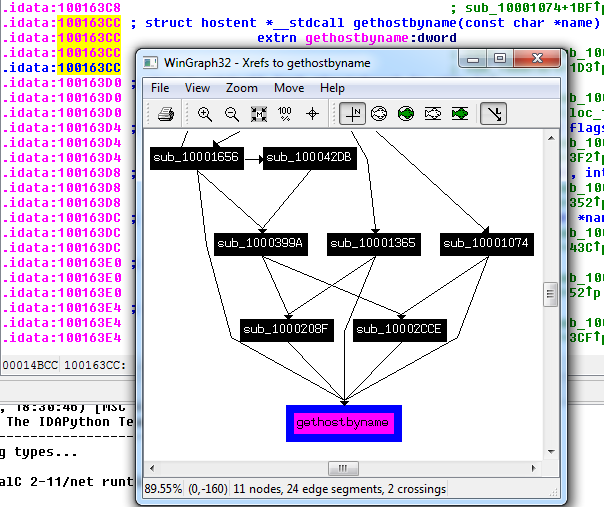
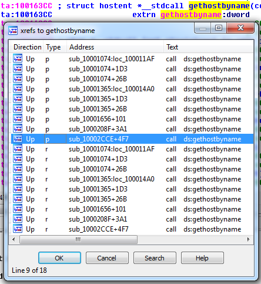
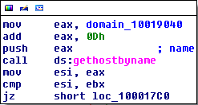
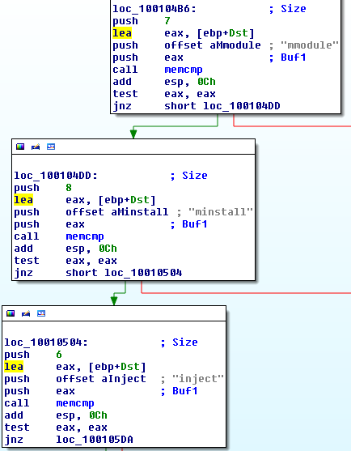
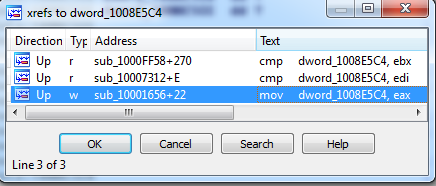
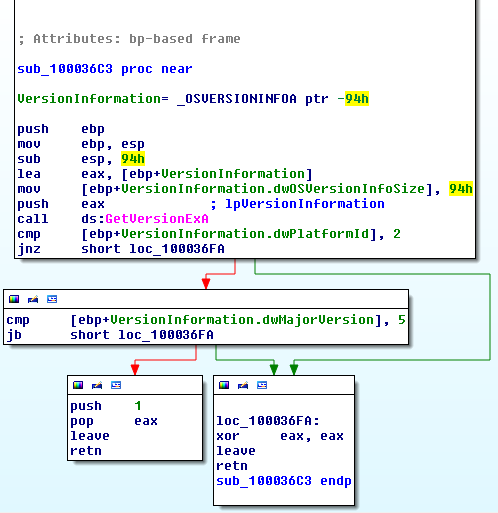
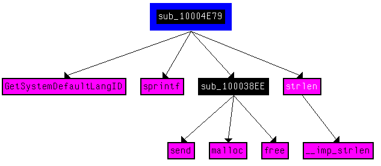
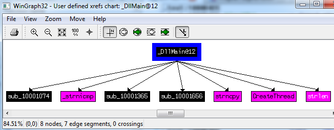

This post is part of the series of [Practical Malware Analysis Exercises.](../index.md)


## 1) Address of `DllMain`?

`.text:1000D02E`

<!--more-->

## 2) Where is the import `gethostbyname` located?

`.idata:100163CC`


## 3) How many functions call `gethostbyname`?

Five functions call `gethostbyname`.





It is called nine times (at first, I thought it was 18).





According to the book, page 495:

> "Some versions of IDA Pro double-count cross-references: p is a reference because it is 
> being called, and r is a reference because it is a "read" reference (since it is call 
> dword ptr [...] for an import, the CPU must read the import and then call into it)."


## 4) `gethostbyname` call at `10001757`: which DNS request will be made?

`pics.practicalmalwareanalysis.com`




	
1. Loads `dword_10019040` into `eax`, pointing to string at `10019194`: 
   `'[This is RDO]pics.praticalmalwareanalysis.com',0`
2. Adds `0Dh` to `eax`, jumping the pointer 13 bytes ahead so that it starts at `pics....`.
3. Pushes the string pointer onto the stack and calls `gethostbyname`, passing the 
   argument: `pics.practicalmalwareanalysis.com`


## 5) How many local variables has IDA recognized for `10001656`?

23


## 6) How many parameters has IDA recognized for `10001656`?

One: `lpThreadParameter`.


## 7) Where is the string "\cmd.exe /c" located?

`xdoord_d:10095B34`


## 8) What is happening in the area of code referencing the string?

Stores the`cmd.exe /c`string, clears a buffer, and opens a receiving network socket. 
Then it receives a remote command and executes it.

Graph view, shows comparisons of suggestive strings.





Guessing this is part of a remote shell.


## 9) At `100101C8`, how is global `dword_1008E5C4` set?


`sub_10003695` checks the platform version, and the return value is applied to `dword_1008E5C4`.

Checked `dword_1008E5C4` xrefs. One of the three references had "w" for write, at `10001687`.





`sub_10003695` is called, and the return value is loaded into `eax`, which is then 
assigned to `dword_1008E5C4`.


The function `sub_10003695` checks the OS version, `GetVersionExA()`. Compares result 
to `VER_PLATFORM_WIN32_NT` (0x02).  If `ZF=1`, then sets `AL=1` and returns.





So essentially:

```text
if version==VER_PLATFORM_WIN32_NT:
  strCmdExe = cmd.exe
else:
  strCmdExe = command.exe
```


## 10) A few hundred lines into `sub_1000FF58`, are a series of memcmp's. What happens when comparison to "robotwork" is successful?


Gets data from the following registry key, formats it, and sends it over the network:

`SOFTWARE\Microsoft\Windows\CurrentVersion\WorkTimes`

1. Calls `sub_100052A2`.
2. `sub_100052A2` tries to open registry key `SOFTWARE\Microsoft\Windows\CurrentVersion`
3. If successful, reads a registry key `WorkTimes`," which is a string represented integer.
4. Combines the registry key value with a format string. Essentially:

```c
sprintf(Dest,
        "\r\n\r\n[Robot_WorkTimes :] %d\r\n\r\n",
        atoi(strWorkTimes) 
);
```

5. `sub_100052A2` returns the constructed string.
6. Execution continues until `sub_100038EE` is called, which sends the finished string 
   through the socket at `10003933`.
7. The socket is initialized by `sub_10010740`: IPv4, TCP


## 11) What does the export PSLIST do?

List running processes and sends the information over a socket.
	
  1. Calls to `CreateToolhelp32Snapshot()`
  2. Sends the name of the process and PID over the socket.
  3. `OpenProcess()`
  4. `EnumProcessModules()`
  5. Sends PID, exe path, and thread count over the socket.
  6. Writes process information to file `xinstall.dll`
  7. Iterates around to the next process.


## 12) Graph XREF's from `sub_10004E79`. Which API functions could be called by this function? Base on the API's alone, what could this function be renamed?


`SendLanugage()`





## 13) How many WinAPI functions does DllMain call directly? How many at a depth of 2?

View -> Graphs -> Xrefs user chart

Depth of 1: 4 WinAPI functions.





Depth of 2: More than 4 WinAPI functions.


## 14) How long will the call to sleep at `10001358` run?

30,000ms = 30s


## 15) At `10001701` is a call to socket. What are the three parameters?

2, 1, 6.


## 16) Use MSDN for socket, and named symbolic constants feature. What parameters can be made more meaningful?


  1. `AF_INET = 2` (IPv4)
  2. `SOCK_STREAM = 1` (TCP)
  3. `IPPROTO_TCP = 6` (TCP)


## 17) Search for "in" instruction (0xED). Often used with string "VMXh" for VMWare detection. Is it present? Further signs of virtualization detection?


Yes, the `in` instruction is present at `100061DB` with `VX` and `VMXh` strings.


Strange instruction at `10006152`, not in the Intel Architecture Manual:

```text
10006152        vpcext 7, 0Bh
```
	
- Google only found 133 hits for `vpcext`.
- [Analyzing a Trojan not detected DElephant (Google Translate)](//laboratorio.blogs.hispasec.com/2014/01/analizando-un-troyano-delephant-no.html)


> "There are few references to this instruction. Basically belong to **Microsoft Virtual 
> PC** and its use in this context would have two hypothetical functions: Stop a debugger 
> or the presence of Virtual PC."

Also found this string at xdoors_d:10094F88:`Found Virtual Machine,Install Cancel.`


## 18) Jump cursor to `1001D988`. What is there?

Looks like the beginning of initialized data.
A series of printable characters, with gaps of non-printable characters. Probably an 
encoded string.


## 19) Move cursor to `1001D988`. Run `Lab05-01.py` IDAPython script.

`Alt-F7`, ran script. Decoded the string:`xdoor is this backdoor, string decoded for Practical Malware Analysis Lab :)1234`


## 20) With the cursor at the same location, how can the data become a single ASCII string?

Hit `A` to decode as an ASCII string.


## 21) Open the Python script in a text editor. How does it work?

XOR encoding with a value of 0x55,
	
  1. Starting at cursor location, loop for 0x50 bytes (80).
  2. Grab the byte.
  3. Perform bitwise XOR: b ^ 0x55 (85)
  4. Patch the resulting byte back.

```python
sea = ScreenEA()


for i in range(0x00,0x50):
    b = Byte(sea+i)
    decoded_byte = b ^ 0x55
    PatchByte(sea+i,decoded_byte)
```
