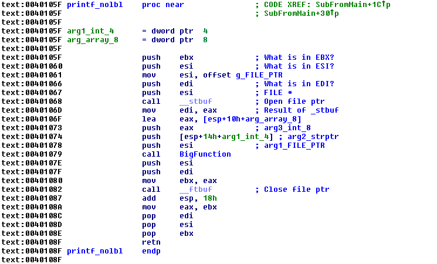

This post is part of the series of [Practical Malware Analysis Exercises.](../index.md)

## 1) What is the major code construct found in the only subroutine called by main?

An if/else conditional jump, after `InternetGetConnectedState()` return.
	
  1. It checks if there is an internet connection.
  2. Returns 1 if success, 0 if error.
  3. It calls a jump table after that, but not directly called by main.

<!--more-->

## 2) What is the subroutine located at 40105F?

Function was an unlabelled `printf()`. Went down the "rabbit hole" during first look.

## 3) What does this program do?

Checks for an Internet connection.
	
  1. Checks for 32 or 64 bit system.
  2. Opens a file handle.
  3. Iterates through characters in a string, processing them with a switch.
  4. Writes characters to a file.

From imports, looks like: Memory, file, process, heap manipulation, and process termination.

## Lessons

  1. IDA doesn't always recognize library code, making it easy to get lost in the forest.
  2. Take a top down, breadth first approach to reversing, focusing on overall code 
     constructs and flow.
  3. Before getting into the details of a function, identify what the arguments passed 
     to it are. Can then try debugging to see a before and after, instead of going line by line.
