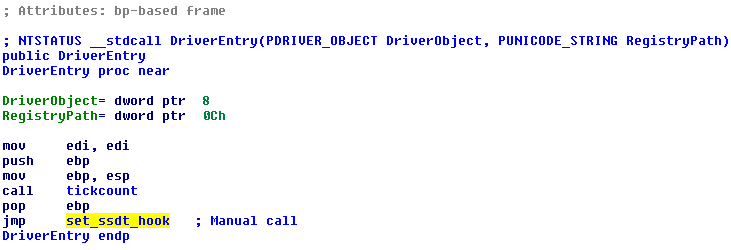
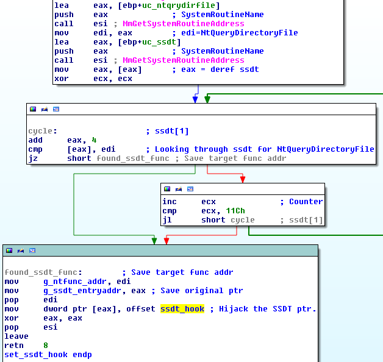
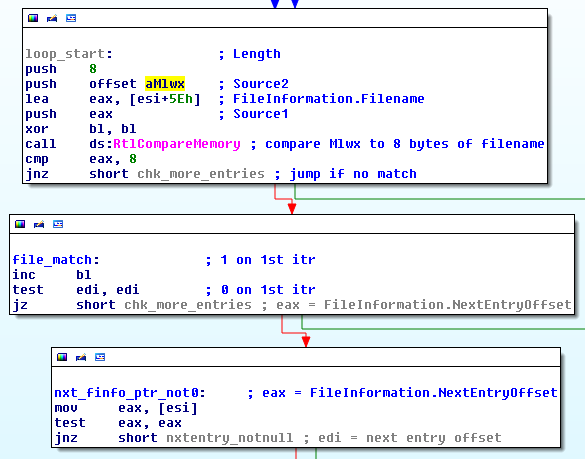

This post is part of the series of [Practical Malware Analysis Exercises.](../index.md)


## 1) Does this program create any files? What are they?

Yes.

**ProcMon**: `C:\WINDOWS\System32\Mlwx486.sys`

After the program ran, file was gone from System32.

<!--more-->

## 2) Does this program have a kernel component?

Yes.

`Mlwx486.sys` gets loaded as `486 WS Driver` driver.


## 3) What does this program do?

Installs a SSDT hooking rootkit service that hides files starting with `Mlwx`

- Extracts a copy of itself that was hidden as a resource.
- Saves it to `C:\WINDOWS\System32\Mlwx486.sys`.
- Loads Mlwx486.sys as a kernel driver via service. Service/Display name:`486 WS Driver`
- Starts the service, with no apparent arguments.
- Once loaded, the driver hooks the SSDT [`NtQueryDirectoryFile`](http://msdn.microsoft.com/en-us/library/windows/hardware/ff556633%28v=vs.85%29.aspx) routine.
- If the first 4 characters of file's name matches `Mlwx` it skips to the next.


**Imports (Lab10-02.exe):**

- Find/load resources.
- Loads libraries.
- Create/start services.
- Create/write files.
- Kills processes.
- Allocate memory.
- GetACP/GetOEMCP.


**Strings (Lab10-02.exe):**

- `B.reloc`
- `c:\winddk\7600.16385.1\src\general\rootkit\wdm\sys\objfre_wxp_x86\i386\sioctl.pdb`
- `040904B0`
- `SIOCTL.sys`


**Resources (Lab10-02.exe):**

- Recursively nested copies of itself.


**Behavioral (Lab10-02.exe):**

- Ran once, did nothing obvious.
- Ran twice, output: `Failed to create service`.


**IDA (Lab10-02.exe):**

- Extracts resource to file `Mlwx486.sys`.
- Loads as kernel driver service named`486 WS Driver`

**ProcMon (Lab10-02.exe):**

- Created `C:\WINDOWS\System32\Mlwx486.sys`
- Wrote to `Mlwx486.sys` twice.
- The .sys file doesn't appear in System32
- The service`486 WS Driver`isn't listed in `psservice`.
- A handle containing `Mlwx486` can't be found in ProcExp.
- **Hypothesis**: Driver is a rootkit with concealment capabilities.


**Immunity (Lab10-02.exe):**

- Set a breakpoint after `Mlwx486.sys` is created, and found the driver file.
- Mlwx486 has debug information in the header.
- Has a resource section with `VersionInfo`


**WinDbg**:

```powershell
ModLoad: f7ed1000 f7ed1d80 Mlwx486.sys

kd> !object \driver
..... snip .....
28 <b>863bc030</b> Driver 486 WS Driver

kd> dt nt!_driver_object <b>863bc030</b>
..... snip .....
+0x02c DriverInit : 0xf7ed17ab
..... snip .....
+0x038 MajorFunction : [28] 0x804fa87e long nt!IopInvalidDeviceRequest+0
```


**IDA (Mlwx486.sys):**

- File was linked with debug information.
- From strings analysis, loaded `sioctl.pdb` as the symbol file.
- **DriverEntry** at 000107ab
  - Doesn't do much. Calls a ticks function, then SSDT.
  - `jmp` instruction to a function that gets SSDT.
  - Looks like a manual call (prolog/epilog, and jmp).
  - No args.
  - No calls other than `RtlInitUnicodeString` and `MmGetSystemRoutineAddress`.





- **set_ssdt_hook:**
  - "mov edi,edi" is hot patch point, "/hotpatch" flag, 2 byte NOP
  - Gets address for system routines from kernel or HAL (`MmGetSystemRoutineAddress`):`NtQueryDirectoryFile `and` KeServiceDescriptorTable`
  - Loops through SSDT 0x11c times (284), looking for `NtQueryDirectoryFile`.



- **ssdt_hook:**
  - Same signature as `NtQueryDirectoryFile`.
  - Forwards call to original `NtQueryDirectoryFile`.
  - Checks if returned structure is type `FileBothDirectoryInformation`.
  - Compares first 8 bytes (4 unicode characters) of filename to `Mlwx`
  - If it matches, skip to next entry.





**Tested:**

- Ran sample.
- Created file `Mlwx.txt` which promptly disappeared.
