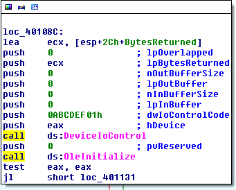

This post is part of the series of [Practical Malware Analysis Exercises.](../index.md)


## 1) What does this program do?

Spawns IE and opens an ad page.

- `svchost` process created that launches `IEXPLORER.EXE` using DCOM.
- URL: `http://www.malwareanalysisbook.com/ad.html`
- Continuously launches Internet Explorer, once every ~30 seconds.
- Service `Process Helper` doesn't appear in `services.msc`, but does when queried:


```powershell
sc query "Process Helper"
```

<!--more-->

**Imports (EXE)**:

- Service creation
- OLE/COM manipulation
- Write files
- Terminate processes
- Command line


**Strings (EXE):**

```text
http://www.malwareanalysisbook.com/ad.html
\\.\ProcHelper
Process Helper
C:\Windows\System32\Lab10-03.sys
```

**RegShot:**

- 12 keys added.
  - All relevant to CurrentControlSet, services.
  - Most have to do with the names like `LEGACY_PROCESS_HELPER` and `Process Helper`
- 36 values added.
  - All relevant to the service.
  - ClassGUID: `{8ECC055D-047F-11D1-A537-0000F8753ED1}`
  - ImagePath: `\??\C:\Windows\System32\Lab10-03.sys`
  - DisplayName: `Process Helper`
  - DeviceDesc: `Process Helper`
- 14 values modified.
  - All have root subkey `HKU\S-1-5-21-2897944768-3285049688-1484071418-500\`
  - Most are in subkeys `CurrentVersion\Ext\Stats` and `CurrentVersion\Internet Settings`
  - Four different UID's. Search results suggest BHO's.
    - `{761497BB-D6F0-462C-B6EB-D4DAF1D92D43}`
    - `{DBC80044-A445-435B-BC74-9C25C1C588A9}`
    - `{E2E2DD38-D088-4134-82B7-F2BA38496583}`
    - `{FB5F1910-F110-11D2-BB9E-00C04F795683}`
  - Two have `\Internet Explorer\Main\Window_Placements`


**IDA (EXE):**

- Only custom function is in [`WinMain`.](http://msdn.microsoft.com/en-us/library/windows/desktop/ms633559%28v=vs.85%29.aspx)
- Creates and starts`Process Helper`service, loading .sys file in System32 as a kernel driver.
- Creates file in device namespace:`\\\\.\\ProcHelper` (`\\.\ProcHelper`) at 00401070.


- Calls [`Kernel32.DeviceIoControl`](http://msdn.microsoft.com/en-us/library/windows/desktop/aa363216%28v=vs.85%29.aspx)
- Target is `\\.\ProcHelper` device.
- Passes custom control code `0x0ABCDEF01`





- Calls [`Ole32.OleInitialize`](http://msdn.microsoft.com/en-us/library/windows/desktop/ms690134%28v=vs.85%29.aspx)
- Calls [`Ole32.CoCreateInstance`](http://msdn.microsoft.com/en-us/library/windows/desktop/ms686615%28v=vs.85%29.aspx)
- CLSID: `0002DF01-0000-0000-C000-000000000046`
- IID: `D30C1661-CDAF-11D0-8A3E-00C04FC9E26E`
- Allocates the string: `http://www.malwareanalysisbook.com/ad.html`


## 2) Once this program is running, how do you stop it?


Delete registry keys and reboot.

- Kill the svchost process' `IEXPLORER.EXE`.

```powershell
> sc stop "Process Helper"; sc delete "Process Helper"
```

- Doesn't work.
- Deleted whole key and subkeys.
  - `HKLM\SYSTEM\ControlSet001\Enum\Root\LEGACY_PROCESS_HELPER\`
  - `HKLM\SYSTEM\ControlSet001\Services\Process Helper\`
- Reboot.
- Driver wasn't loaded. No IE popups.
- Delete associated .sys and .exe files.
- No other persistence mechanism.


## 3) What does the kernel component do?

Hides processes via device IO requests using the following IRPs:

- [0] = [IRP_MJ_CREATE] = f7f23606 = process
- [2] = [IRP_MJ_CLOSE]  = f7f23606 = process
- [e] = [IRP_MJ_DEVICE_CONTROL] = f7f23666 = process_withptr


**Imports (SYS):**

- Create/delete devices.
- Create/delete symbolic links.
- Get processes
- Complete IO requests.


**Strings (SYS):**

```text
c:\winddk\7600.16385.1\src\general\rootkitprochide\wdm\sys\objfre_wxp_x86\i386\sioctl.pdb
\DosDevices\ProcHelper
\DosDevices\ProcHelper
\Device\ProcHelper
FileDescription
Important Process Helper
LegalCopyright
 ABC Corp.
```

**IDA (SYS):**

- DriverEntry + 5 functions.
- DriverEntry only calls small `KeTickCount` related function.
- All functions have simple structure.
- create_device:
  - Creates the device `\\Device\ProcHelper`
  - Creates symbolic link to device, or deletes if it fails.


**Immunity/WinDbg:**


- Found the driver. Set BP on [`Advapi32.StartServiceA`](http://msdn.microsoft.com/en-us/library/windows/desktop/ms686321%28v=vs.85%29.aspx), hit, stepped over.

```powershell
ModLoad: f7f23000 f7f23e00   Lab10-03.sys
```

- WinDbg break

```powershell
kd> !object \driver
05  863b5c08 Driver        Process Helper
dt nt!_DRIVER_OBJECT 863b5c08
+0x000 Type             : 0n4
+0x002 Size             : 0n168
+0x004 DeviceObject     : 0x863a8880 _DEVICE_OBJECT
+0x008 Flags            : 0x12
+0x00c DriverStart      : 0xf7f23000 Void
+0x010 DriverSize       : 0xe00
+0x014 DriverSection    : 0x865f1c68 Void
+0x018 DriverExtension  : 0x863b5cb0 _DRIVER_EXTENSION
+0x01c DriverName       : _UNICODE_STRING "\Driver\Process Helper"
+0x024 HardwareDatabase : 0x8068fa90 _UNICODE_STRING "\REGISTRY\MACHINE\HARDWARE\DESCRIPTION\SYSTEM"
+0x028 FastIoDispatch   : (null)
+0x02c DriverInit       : 0xf7f237cd     long Loading symbols for f7f23000     Lab10-03.sys ->   Lab10-03.sys
+0x030 DriverStartIo    : (null)
+0x034 DriverUnload     : 0xf7f2362a     void  +0
+0x038 MajorFunction    : [28] 0xf7f23606     long  +0
```

- IRP offsets in _MajorFunction_ table:
    * [0] = [IRP_MJ_CREATE] = f7f23606 = process
    * [2] = [IRP_MJ_CLOSE] = f7f23606 = process
    * [e] = [IRP_MJ_DEVICE_CONTROL] = f7f23666 = process_withptr
- Found the device.

```powershell
8666af18 Device        ProcHelper

kd> dt nt!_device_object 8666af18
+0x000 Type             : 0n3
+0x002 Size             : 0xb8
+0x004 ReferenceCount   : 0n1
+0x008 DriverObject     : 0x865323f0 _DRIVER_OBJECT
+0x00c NextDevice       : (null)
+0x010 AttachedDevice   : (null)
+0x014 CurrentIrp       : (null)
+0x018 Timer            : (null)
+0x01c Flags            : 0x40
+0x020 Characteristics  : 0x100
+0x024 Vpb              : (null)
+0x028 DeviceExtension  : (null)
+0x02c DeviceType       : 0x22
+0x030 StackSize        : 1 ''
+0x034 Queue            : __unnamed
+0x05c AlignmentRequirement : 0
+0x060 DeviceQueue      : _KDEVICE_QUEUE
+0x074 Dpc              : _KDPC
+0x094 ActiveThreadCount : 0
+0x098 SecurityDescriptor : 0xe13ca230 Void
+0x09c DeviceLock       : _KEVENT
+0x0ac SectorSize       : 0
+0x0ae Spare1           : 0
+0x0b0 DeviceObjectExtension : 0x8666afd0 _DEVOBJ_EXTENSION
+0x0b4 Reserved         : (null)
```
