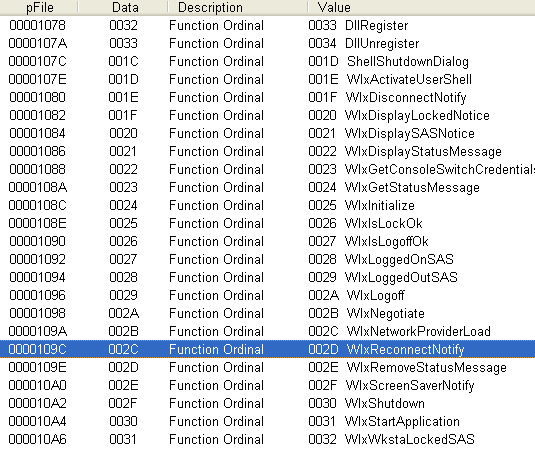
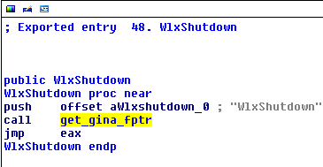
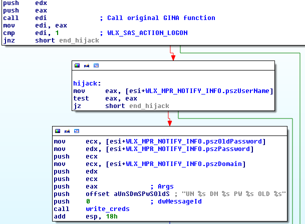
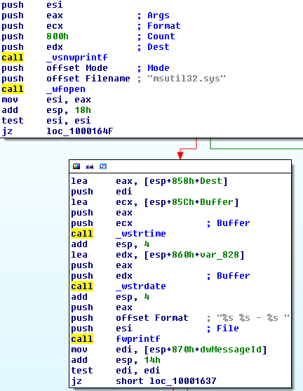

This post is part of the series of [Practical Malware Analysis Exercises.](../index.md)


## 1) What does the malware drop to disk?

Original EXE contains a DLL in the resource section. It drops the DLL to the working
directory as `msgina32.dll`. It is a GINA interceptor.

Examined exported functions for `msgina32.dll` in PEView, which showed many functions
prefixed with `Wlx`. These must be exported by GINA intercepting DLL's in order to
pass along all information.

<!--more-->




## 2) How does the malware achieve persistence?

EXE creates a registry key that specifies the DLL as a GINA DLL.

RegShot showed this key added:

```text
HKLM\SOFTWARE\Microsoft\Windows NT\CurrentVersion\Winlogon\GinaDLL: "C:\Documents and Settings\testuser\Desktop\msgina32.dll"
```


## 3) How does the malware steal credentials?

It implements `WlxLoggedOutSAS`, which copies the username, old and new passwords, and
the domain.

Looked at the DLL's functions in IDA. Most of the `Wlx` functions were just forwarded,
like `WlxShutdown`.





All except for [`WlxLoggedOutSAS`](http://msdn.microsoft.com/en-us/library/windows/desktop/aa380571%28v=vs.85%29.aspx)
at `.text:100014A0`. This subroutine forwards the information like the others, but also
checks return value for `WLX_SAS_ACTION_LOGON` (user is logging on). If true, it copies
the username, old and new passwords, and the domain from the
[`WLX_MPR_NOTIFY_INFO`](http://msdn.microsoft.com/en-us/library/windows/desktop/aa381180(v=vs.85).aspx) structure.





## 4) What does the malware do with stolen credentials?

Writes the user, domain, password, old password to the text file
`C:\Windows\System32\msutil32.sys`.

It formats the collected values within a string, and passes the string to the subroutine
at `.text:10001570`. The subroutine formats another string and logs it to
`C:\Windows\System32\msutil32.sys`."





`msutil32.sys` is a plain text file with no encoding, storing timestamped credentials.

```text
02/12/14 19:16:33 - UN testuser DM XPPMA PW  OLD (null)
```

## 5) How can you use this malware to get user credentials from your test environment?


Reboot and log in.
