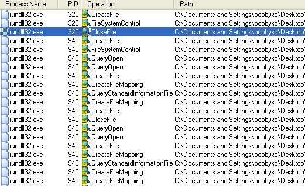
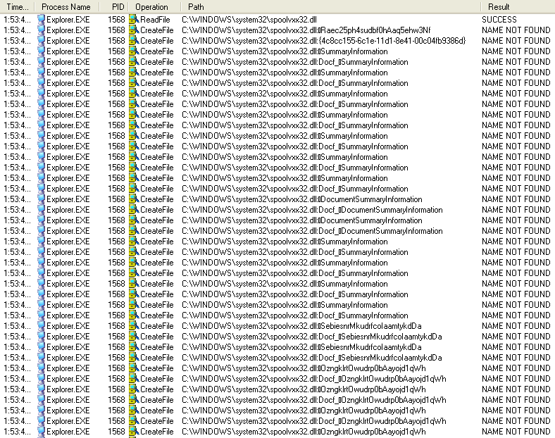
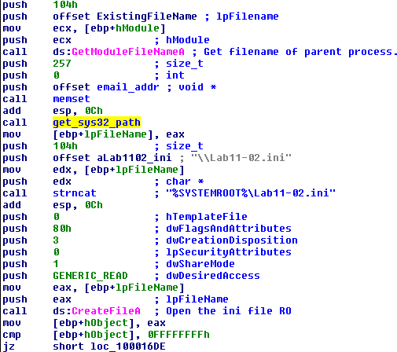
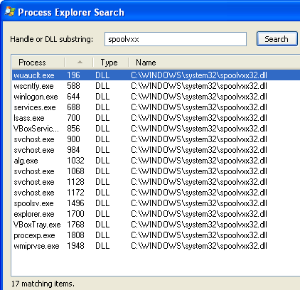
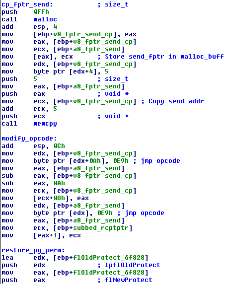
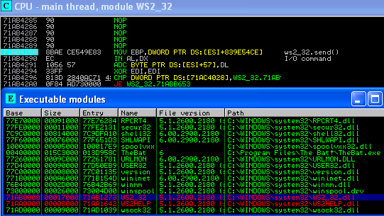
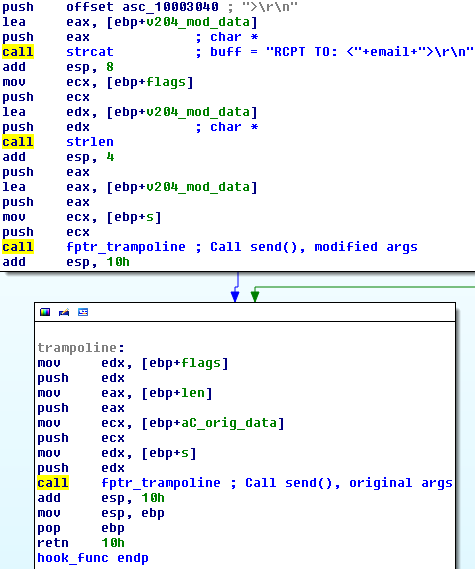
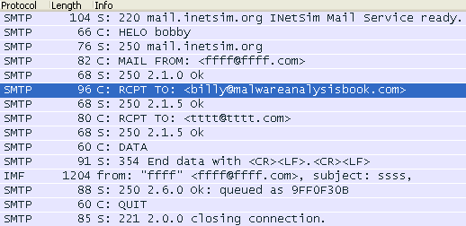
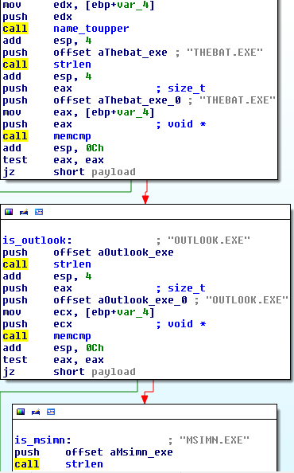
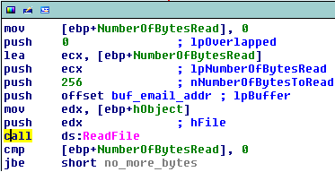

This post is part of the series of [Practical Malware Analysis Exercises.](../index.md)


## 1) Exports for this DLL malware?

Only one export in the DLL: "0001 installer"


<!--more-->

## 2) What happens after installation attempt with rundll32.exe?

The DLL copies itself to `C:\WINDOWS\system32\spoolvxx32.dll`, and sets an `AppInit_DLLs` registry value.

Started capturing events with `Process Monitor`, and ran `rundll32`.

```powershell
rundll32 Lab11-02.dll
rundll32 Lab11-02.dll,installer
```

Tried different filters in `ProcMon` to find relevant information.

Filter: Path (contains) - Shows two different rundll instances, PID 320 and 940.

- PID 320 had three events total, nothing notable.
- PID 940 had 35 events.
  - RegSetValue:`HKLM\SOFTWARE\Microsoft\Windows NT\CurrentVersion\Windows\AppInit_DLLs:spoolvxx32.dll`
  - Tries to access file `C:\WINDOWS\system32\Lab11-02.ini`, but doesn't exist.
  - Creates file `C:\WINDOWS\system32\spoolvxx32.dll`.
- Also shows an instance of svchost querying information.





Filter: path (contains) `spoolvxx` - Looks like `Explorer.exe` is looking for files 
contained within a `spoolvxx32.dll` alternate data stream.





Both the original DLL and the newly created `spoolvxx32.dll` have the same MD5: 
`be4f4b9e88f2e1b1c38e0a0858eb3dd9`.


## 3) Where must Lab11-02.ini be for malware to install?

`C:\WINDOWS\system32` (alias `%SYSTEMROOT%`)

ProcMon shows attempted file access of `C:\WINDOWS\system32\Lab11-02.ini`. Also, 
disassembly of `DllMain` in IDA shows the attempted access.





## 4) How is the malware installed for persistence?

The DLL sets a `AppInit_DLLs` registry key value to itself, so that it is loaded with `User32.dll`.

Registry key: `HKLM\SOFTWARE\Microsoft\Windows\CurrentVersion\Windows\AppInit_DLLs : "spoolvxx32.dll"`

Restarted virtual machine for the `AppInit_DLLs` registry changes to take effect. 
`Process Explorer` shows 17 processes with handles to `spoolvxx32.dll`.





## 5) What user-space rootkit technique is used?

Inline hook on `ws2_32.send()`.

When the malicious DLL is loaded into the process space:

  1. Suspend the thread if parent process is target.
  2. Install the hook.
  3. Resume the thread.


Hook installation code at .text:10001561





Launched `Outlook Express` under `Immunity`, configured to break on each DLL load. 
The screenshot below shows the MOV instruction before the opcodes are overwritten.





After the malicious DLL loaded, the inline hook's hard jump was inserted.


## 6) What does the hooking code do?


The inline hook on `ws2_32.send()` sends copies of email to a malicious recipient, `billy@malwareanalysisbook.com`.

It is triggered when the following conditions are met:
	
  1. One of the predefined mail clients is used.
  2. A `RCPT TO` SMTP command is being sent via `ws2_32.send()`.

The hook adds an additional `RCPT TO` command.





Ran a `Remnux VM` instance, with `inetsim` simulating an email server. Debugged 
`Outlook Express` under `Immunity`, and verified the inline hook was set.

Sent a message, which triggered the hook breakpoint, and sent a copy to 
`billy@malwareanalysisbook.com`, as observed via `wireshark`.





## 7) Which process(es) does this malware attack and why?

The following mail clients:
	
- thebat.exe
- outlook.exe
- msimn.exe


Code starting at `.text:100014EC` shows this clearly.





According to `Dependency Walker`, `The Bat` no longer directly imports `ws2_32` 
or `wsock32`. When breakpoints are set on those functions in `Immunity`, they 
are not triggered, and the hook is never called. This sample doesn't work for 
the current version of `The Bat`.


## 8) What is the significance of the .ini file?

Contains an encoded email address to send copied messages to.

Each time DLL is loaded, entry point reads 256 bytes from the .ini file.





A function at `.text:100010B3` decodes the email address from the .ini file byte by byte.


## 9) How can you capture malware activity with Wireshark?

  1. Install the malware.
  2. Setup an instance of `REMNUX` running `inetsim` and `wireshark`.
  3. Use the `Outlook Express` client, `msimn.exe` to send an email.
