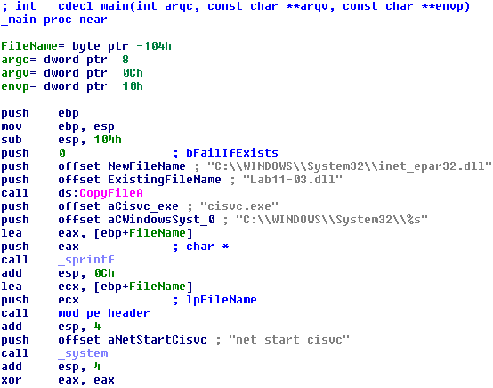
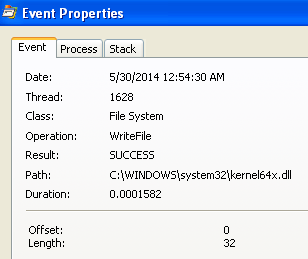
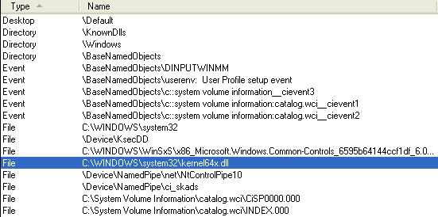
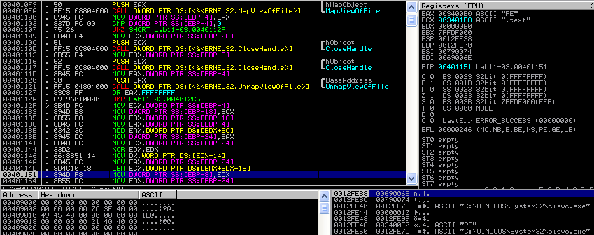

This post is part of the series of [Practical Malware Analysis Exercises.](../index.md)

## 1) What interesting leads can you discover using basic static analysis?

The EXE starts a service.
	
- String: `net start cisvc`

The DLL has the imports of a polling keylogger, and a suggestive string.

<!--more-->
- Import: `GetForegroundWindow`
- Import: `GetAsyncKeyState`
- String: `<SHIFT>`

Files to look out for:

- String: `C:\WINDOWS\System32\inet_epar32.dll`
- String: `C:\WINDOWS\System32\kernel64x.dll`
- String: `Lab1103dll.dll`

## 2) What happens when you run the malware?

The EXE copies a DLL to`C:\WINDOWS\System32\inet_epar32.dll`.

The EXE maps an instance of the system file `C:\WINDOWS\System32\cisvc.exe`, the 
[Content Indexing Service](http://msdn.microsoft.com/en-us/library/ee805985%28v=vs.85%29.aspx).

The EXE spawns an instance of `cmd.exe`, which starts the `cisvc` service.

cisvc creates the file `C:\WINDOWS\System32\kernel64x.dll`.

This instance of cisvc has a handle to `C:\WINDOWS\System32\kernel64x.dll` shown in 
Process Explorer.

The EXE must have done something to `cisvc.exe` when it was mapped. Looking at the 
MD5 hashes of `cisvc.exe` before and after the malware is run:

Before: `3192bd04d032a9c4a85a3278c268a13a`
After:  `406a2552ec6eb84fd23a1f2f65442285`

## 3) How does the exe persistently install the dll?

The EXE trojans the `C:\Windows\System32\cisvc.exe` binary, which executes when the Content Indexing Service starts.

## 4) Which Windows system file does the malware infect?

The malware trojans the `C:\Windows\System32\cisvc.exe` binary. It adds strings to 
.text section at 0xF31.

Found the string`C:\WINDOWS\System32\inet_epar32.dll`in the cisvc binary at 0xF31, at 
the end of the .text section. Didn't show up in PEView. Looked at that region of 
`cisvc.exe`'s PE header in a hex editor, before and after the malware ran.

The NULL bytes from E28h to F5Fh (137h, 311 bytes) were replaced with something, 
including the path strings. Looks like shellcode.

Before malware execution:

After malware execution:

The code for trojaning the binary with a reference to the malicious DLL starts at 401070. 
Below is a screenshot of part of this function under a debugger.

Note that `C:\Windows\System32\cisvc.exe` has recently been used on the stack, because 
it was mapped, and that references to the strings `PE` and `.text` are loaded into EAX 
and ECX, respectively.

The full shellcode is stored in the EXE at 409030. The function loops, writing each 
byte of the shellcode to the end of the `.text` section. Setting a breakpoint on 
40120D reveals each byte in the EAX register, matching those found in the PE header. 
55h, 89h....

`C:\WINDOWS\System32\inet_epar32.dll` is the malicious DLL opened by trojaned EXE, 
and `zzz69806582` is an export within that DLL.

The modifications redirect the entry point to the shellcode, which loads the malicious DLL.

## 5) What does the DLL do?

Export `zzz69806582` creates a thread that runs a polling keylogger.
Window titles and keystrokes in hex are saved to `C:\WINDOWS\System32\kernel64x.dll`.
Sleeps for 10ms between polls.

## 6) Where does malware store the data it collects?

The file `C:\WINDOWS\System32\kernel64x.dll`.
