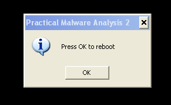
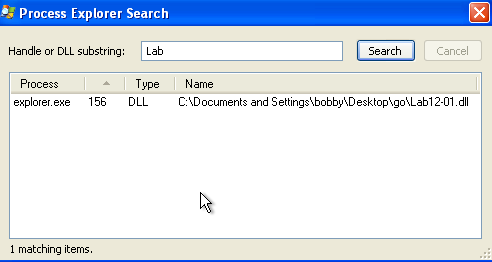

This post is part of the series of [Practical Malware Analysis Exercises.](../index.md)

## 1) What happens when you run the malware executable?

When the EXE is run from the command line, without arguments, a message box pops up 
with the title `Practical Malware Analysis 0` and the text `Press OK to reboot.` Clicked 
on it, and nothing happens. Each minute, the same message box appears with the title
`Practical Malware Analysis X`, where X is an incremented counter.

<!--more-->

In Process Explorer the CPU usage for Interrupts is up between 65-85%.

## 2) What process is being injected?

Running strings against the EXE shows `explorer.exe` and `Lab12-01.dll`. Searching 
for the handle `Lab` in Process Explorer gets a single hit on `explorer.exe`.

## 3) How can you make the malware stop the pop-ups?

Restarting the computer stops the malware. It doesn't have a persistence mechanism.

## 4) How does this malware operate?

The EXE starts by loading 
[psapi.dll](http://msdn.microsoft.com/en-us/library/windows/desktop/ms684884%28v=vs.85%29.aspx), and getting the process addresses for 
[EnumProcessModules](http://msdn.microsoft.com/en-us/library/windows/desktop/ms682631%28v=vs.85%29.aspx), 
[GetModuleBaseNameA](http://msdn.microsoft.com/en-us/library/windows/desktop/ms683196%28v=vs.85%29.aspx), 
and [EnumProcesses](http://msdn.microsoft.com/en-us/library/windows/desktop/ms682629%28v=vs.85%29.aspx). 
Then, it iterates through the processes looking for `explorer.exe`.

When the EXE discovers `explorer.exe`, it performs DLL injection, forcing the target to load `Lab12-01.dll` into a new thread from disk.

The DLL just creates a parent thread, that launches a child thread once per minute, which 
shows the message box. This will happen until stopped.
