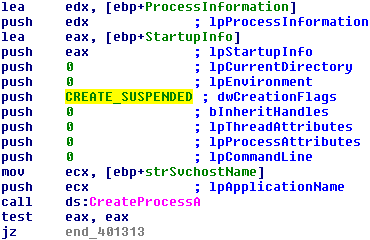
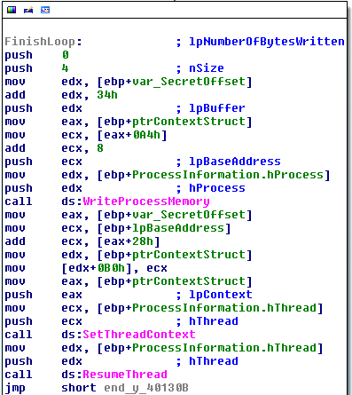

This post is part of the series of [Practical Malware Analysis Exercises.](../index.md)


## 1) What is the purpose of this program?

This is a stealth launcher that uses process replacement to execute a usermode hooking 
keylogger. The keylogger stores window titles and keystrokes in plain text to the file 
`practicalmalwareanalysis.log` in the working directory.

<!--more-->

## 2) How does the launcher program hide execution?


The launcher program uses process replacement on an svchost.exe instance to hide the 
keylogging executable.

First, the launcher program creates an instance of svchost.exe in a suspended state, 
calling [CreateProcess](http://msdn.microsoft.com/en-us/library/windows/desktop/ms682425%28v=vs.85%29.aspx) 
with the `CREATE_SUSPENDED` flag.





It then follows through with unmapping, allocating, writing new code, setting the 
thread context, and resuming the `svchost` thread with the keylogging code.





## 3) Where is the malicious payload stored?

The launcher executable has a resource named `LOCALIZATION`. The keylogger 
executable is stored in that resource, to be later loaded into dynamically 
allocated space.


## 4) How is the malicious payload protected?

The entire payload (keylogger PE executable) is hidden in the resource section and 
XOR encoded, using 41h (`A`) as the key.

Found where the XOR decoding routine is called at 401425, and saw that it compares the 
first two bytes to `MZ`, the signature of a PE executable. If it isn't `MZ`, the 
decoding code is called with the key, 41h.


The resource was extracted to a binary file with Resource Hacker. A short python 
script was used to decode the bytes, and save the results to a file.

```python
res_file = &quot;Lab12-02_resource&quot;
decode_file = &quot;Lab12-02_decoded.exe&quot;
xor_byte = 0x41&lt;/code&gt;

bytes = bytearray(open(res_file, &quot;rb&quot;).read())
for i in range(len(bytes)):
    bytes[i] ^= xor_byte

open(decode_file, &quot;wb&quot;).write(bytes)
```


## 5) How are strings protected?

The entire payload, including the strings, are XOR encoded with `A` as the key. 
The decoding routine is at 401000.


