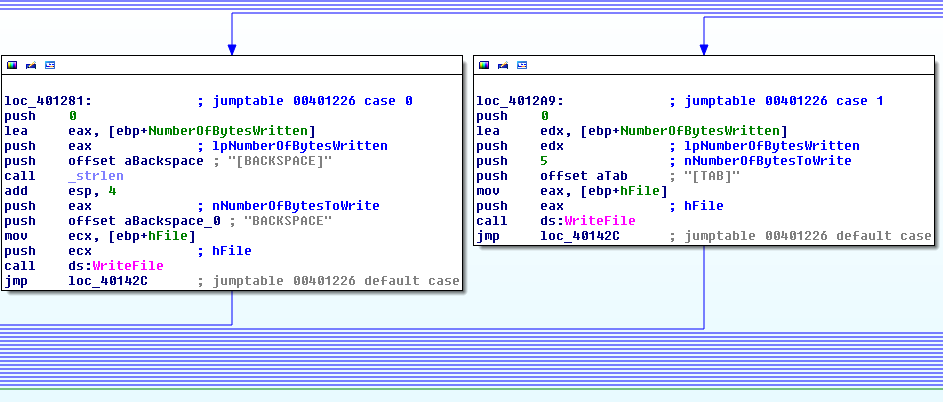
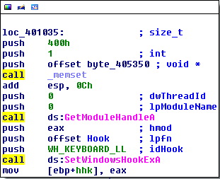
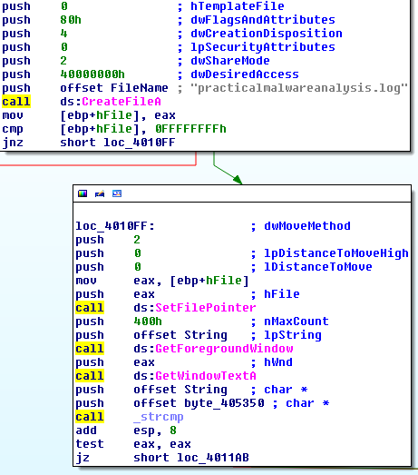

This post is part of the series of [Practical Malware Analysis Exercises.](../index.md)

## 1) What is the purpose of the malicious payload?

The MD5 hash, `a7f21e412022554d187d6a876a3c08ac`, identifies this executable as the 
payload from Lab12-02. There are many signs indicative of keylogging functionality.

<!--more-->

Strings include`[TAB]`and`[CAPS LOCK]`. Imported functions include the ability to:

- Set and remove Windows event hooks.
- Get the foreground window text.
- Create and terminate processes.
- Create and write files.
- Load arbitrary library functions.

IDA verified that this is a usermode hooking keylogger. The hook calls the keystroke 
log routine at 4010A7, whenever a key press 
([WM_SYSKEYDOWN](http://msdn.microsoft.com/en-us/library/windows/desktop/ms646286%28v=vs.85%29.aspx) 
or [WM_KEYDOWN](http://msdn.microsoft.com/en-us/library/windows/desktop/ms646280%28v=vs.85%29.aspx)) event is detected.

Non-printable keystrokes are converted using a large jump table, meaning that a switch 
statement was used. The picture below shows code for converting the `[BACKSPACE]` and 
`[TAB]` keystrokes.

## 2) How does the malicious payload inject itself?

The main function hooks low level keyboard events by calling 
[SetWindowsHookEx](http://msdn.microsoft.com/en-us/library/windows/desktop/ms644990%28v=vs.85%29.aspx)
at 40105B, with the `idHook` parameter set to 
[WH_KEYBOARD_LL ](http://msdn.microsoft.com/en-us/library/windows/desktop/ms644959%28v=vs.85%29.aspx#wh_keyboard_llhook)
(0Dh). The hook code will be called whenever a `WH_KEYBOARD_LL` event is processed.

## 3) What filesystem residue does the program create?

The program logs window titles and keystrokes to the cleartext file 
`practicalmalwareanalysis.log`, in the working directory. The keystroke logging 
function does this at 4010C7, calling 
[CreateFileA](http://msdn.microsoft.com/en-us/library/windows/desktop/aa363858%28v=vs.85%29.aspx) 
each time.

