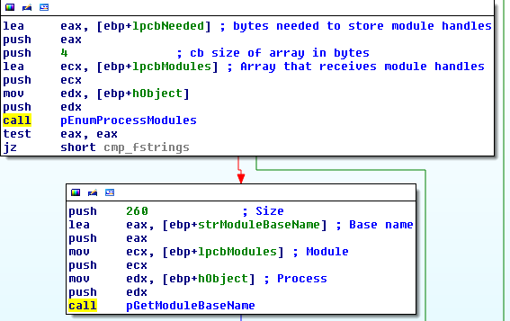
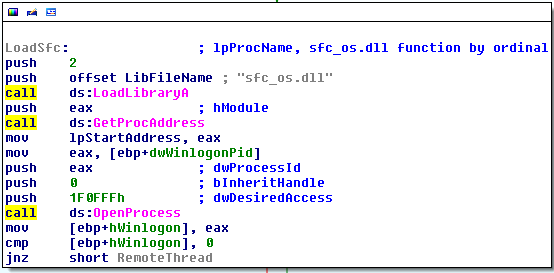
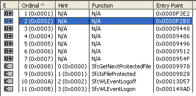
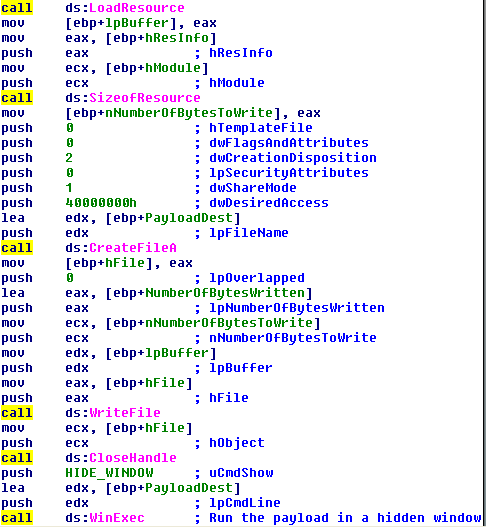
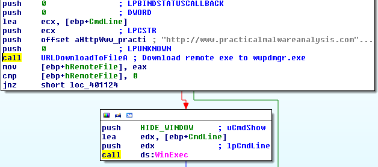

This post is part of the series of [Practical Malware Analysis Exercises.](../index.md)

## 1) What does the code at 0x401000 accomplish?

Given a PID, the function checks if the module's name is `Winlogon.exe`. It returns 
1 if so, or 0 if not.

Around 4013AA in main, global function pointers are set for [EnumProcesModules](http://msdn.microsoft.com/en-us/library/windows/desktop/ms682631%28v=vs.85%29.aspx) and [GetModuleBaseNameA](http://msdn.microsoft.com/en-us/library/windows/desktop/ms683196%28v=vs.85%29.aspx).

<!--more-->

Then these functions are used to search through a process' module names for the 
string `Winlogon.exe`.

And return 1 or 0 based on the findings.

## 2) Which process has code injected?

The `Winlogon.exe` process has code injected into it, with a call to [CreateRemoteThread](http://msdn.microsoft.com/en-us/library/windows/desktop/ms682437%28v=vs.85%29.aspx) at 4011ED in the main executable.

## 3) What DLL is loaded using LoadLibraryA?

`sfc_os.dll` is loaded by the main malware at 4011A8 via [LoadLibraryA](http://msdn.microsoft.com/en-us/library/windows/desktop/ms684175%28v=vs.85%29.aspx). This library is for [Windows File Protection (WFP)](https://en.wikipedia.org/wiki/Windows_File_Protection), which monitors the integrity of system files.

## 4) What is the fourth argument passed to the CreateRemoteThread call?

The fourth argument is the address for the remote thread to begin execution. In this 
case, it points to the undocumented function sfc_os.[SfcTerminateWatcherThread](vxheaven.org/lib/vra03.html#c1), which will disable Windows File Protection, allowing system files to be modified.

The remote thread was set to execute beginning at a function in `sfc_os.dll`, referenced by the ordinal "2" during the call to [GetProcAddress](http://msdn.microsoft.com/en-us/library/windows/desktop/ms683212%28v=vs.85%29.aspx).

Viewing `sfc_os.dll` through Dependency Walker doesn't give a name for the ordinal, 
only an offset.

However, viewing `sfc_os.dll` through IDA shows that the ordinal references the 
function `SfcTerminateWatcherThread`, which disables Windows File Protection.

## 5) What malware is dropped by the main executable?

The payload is stored as a resource. In the function at 4011FC, the binary is extracted, written to`%SYSTEMROOT%\System32\wupdmgr.exe`in place of the original system file, and executed in a hidden window with a call to [WinExec](http://msdn.microsoft.com/en-us/library/windows/desktop/ms687393%28v=vs.85%29.aspx).

## 6) What is the purpose of this and the dropped malware?

The main malware causes Winlogon.exe to drop Windows File Protection, so that system 
files can be modified, and drops a payload. The dropped malware is a downloader 
disguised as Windows Update Manager. The downloader program retrieves a remote binary 
and executes it.

The main malware first disables WFP, moves the Windows system binary `wupdmgr.exe` to 
`winup.exe` at 4014E4, and then replaces it with the extracted payload.

The payload executable launches the original Windows Update Manager, `wupdmgr.exe`, to prevent suspicion. It finishes by downloading the remote file "[http://www.practicalmalwareanalysis.com/updater.exe](http://www.practicalmalwareanalysis.com/updater.exe)" to `%SYSTEMROOT%\System32\wupdmgrd.exe` and executing it in a hidden window with WinExec. The URL doesn't link to the file.

