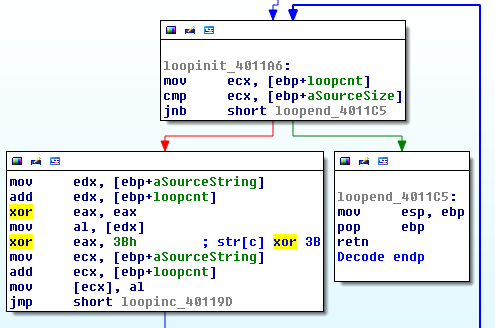
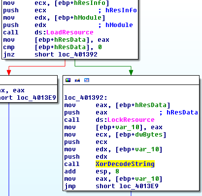
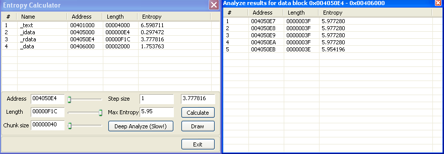
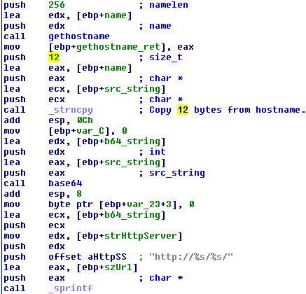
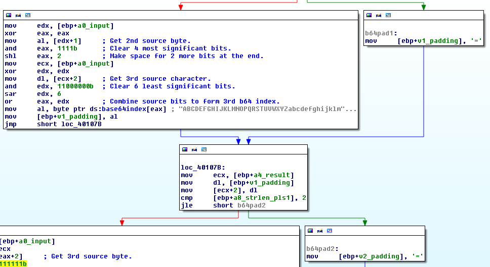

This post is part of the series of [Practical Malware Analysis Exercises.](../index.md)

## 1) Compare the strings in the malware with the information available via dynamic analysis. Based on this comparison, which elements might be encoded?

The beaconing URL is encoded.

The format string `http://%s/%s/` is for a URL, whose host and path are probably encoded. 
Wireshark showed regular HTTP GET requests to 
`http://www.practicalmalwareanalysis.com/Ym9iYnkteHAzMg==`, but `practicalmalwareanalysis.com` 
doesn't appear in the strings output. The request `Ym9iYnkteHAzMg==` is a base64 encoded string.

<!--more-->

## 2) Use IDA to look for potential encoding by searching for the string xor. What type of encoding do you find?

The subroutine at 00401190 implements single byte XOR encoding. The XOR instruction 
is at 004011B8.

## 3) What is the key used for encoding and what content does it encode?

The key used for XOR encoding is the single byte `3Bh`.

The XOR encoding works on data stored in the resource section, as indicated by the 
function calls shown in IDA.

Resource Hacker showed that the executable contains a small resource at 00007060.

Under HexEdit, the bytes at 00007060 were XOR'd with 3Bh, which resulted in the string 
`www.practicalmalwareanalysis.com`."

## 4) Use the static tools FindCrypt2, Krypto ANALyzer (KANAL), and the IDA Entropy Plugin to identify any other encoding mechanisms. What do you find?

KANAL found a base64 table with four references.

The first check for high entropy content, using the IDA Entroy Plugin, set the chunk 
size to 64 (40h) and the max entropy to 5.95. This configuration was run against the 
.rdata section, which found high entropy content at 004050E8.

Viewing this address in IDA revealed a standard base64 index string at 004050E8.

A chunk size of 128=2^7 (80h) with max entropy 6.9 didn't produce any results in any section. 
No results with a chunk size of 256=2^8(100h) with max entropy 7.9 either.

## 5) What type of encoding is used for a portion of the network traffic sent by the malware?

Base64 is used to encode the GET request, which is the infected machine's hostname.

Wireshark showed that `http://www.practicalmalwareanalysis.com/Ym9iYnkteHAzMg==` is 
requested every 30 seconds. The HTTP server was not apparent in strings, because it 
was XOR encoded as discovered earlier. The request path is a base64 encoded string, 
given away by the character set and padding. The decoded string was the infected 
machine's hostname, `bobby-xp32`.

## 6) Where is the Base64 function in the disassembly?

The base64 function is located at 004010B1.

Cross referencing the base64 index string returned four hits, all in the same 
routine at 00401000.

This function takes three bytes and performs bitwise operations on them to return four 
base64 encoded bytes. The function that calls it, at 004010B1, takes a string and feeds 
three bytes at a time to the encoding routine in a loop.

## 7) What is the maximum length of the Base64-encoded data that is sent?

The maximum length is 16 bytes.

12 bytes of the hostname are copied to a string for base64 encoding. A 12 byte string 
would result in a 16 byte base64 string.

## 8) In this malware, would you ever see the padding characters (= or ==) in the Base64-encoded data?

Yes. The Wireshark output shows GET requests for `Ym9iYnkteHAzMg==` and the code in 
IDA at 00401077 and 004010A0 show that `=` padding characters are used.

## 9) What does this malware do?

This malware beacons it's hostname every 30 seconds to `www.practicalmalwareanalysis.com` 
via a HTTP GET request, until it receives a response starting with the letter `o`. 
Could be a bot signaling to a C&C server that it's online.
