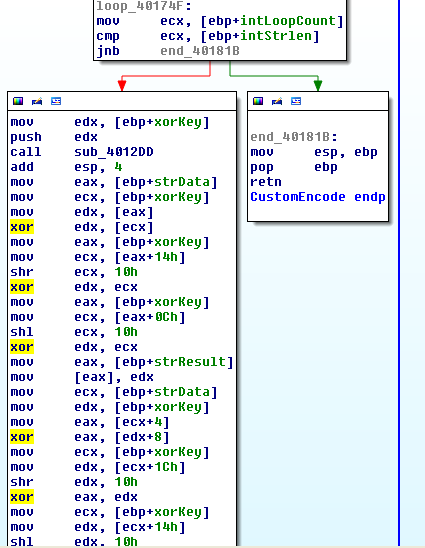
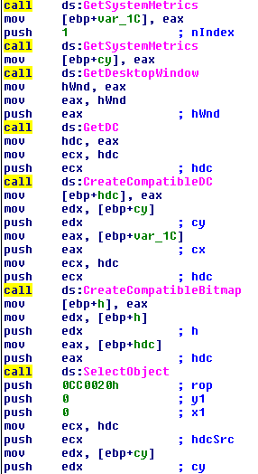

This post is part of the series of [Practical Malware Analysis Exercises.](../index.md)


## 1) Using dynamic analysis, determine what this malware creates.

The malware creates 4MB files in the working directory, every 10 seconds, named things like 
`temp0004f3ae` with no extension.


No strange network traffic or registry keys were detected.

<!--more-->

## 2) Use static techniques such as an xor search, FindCrypt2, KANAL, and the IDA Entropy Plugin to look for potential encoding. What do you find?


KANAL didn't find anything. An XOR search in IDA found 20 results, 4 of which were only 
for nulling out registers. Twelve of the interesting XOR instuctions were in the function 
at 00401739, one at 0040128D, and one at 00401000. Strangely, three of the interesting 
instructions did not belong to any function, at 0040311E, 0040311A, and 0040171F.


A look at the function 00401739 reveals a custom encoding loop, with a mix of XOR and 
shift instructions.





Running the IDA Entropy Plugin didn't find anything unusual. Chunk sizes 64, 128, and 
256 were used with max entropy settings of 5.9, 6.9, and 7.9, respectively.


## 3) Based on your answer to question 1, which imported function would be a good prospect for finding the encoding functions?


WriteFile would be a good place to start. Data is usually obfuscated shortly before 
being output to a file or network.


## 4) Where is the encoding function in the disassembly?


The primary encoding function that handles all of the subsequent steps is located at 0040181F.

Quickly looking at the layout of the functions, and some of their instructions, showed a 
series of three more functions that call each other. All three have what look like encoding 
instructions, XOR's and shifts.


## 5) Trace from the encoding function to the source of the encoded content. What is the content?


The content is a bitmap of the desktop. This program is taking screenshots, encoding them, and saving them to a file, every 10 seconds.

Tracing the encoding back to the coordinating code shows that the function at 00401070 is 
providing the source data. It contains a series of function calls for taking a screenshot of 
the desktop and putting it in a bitmap to return.





## 6) Can you find the algorithm used for encoding? If not, how can you decode the content?

The algorithm was found, but instrumentation is necessary.

The algorithm doesn't look like anything standard. It's across three functions containing 
shifts, XOR's, and other manipulations. Apparently, only an encoding routine is present, 
not a decoding routine. Decoding the content would require painstakingly reconstructing 
the inverse of the encoding function, or by using instrumentation.


## 7) Using instrumentation, can you recover the original source of one of the encoded files?


The `EncodeData` function at 0040181F takes only two arguments; the memory buffer to encode 
(EBP+8), and the size of the buffer (EBP+12). Only these need to be accounted for.

The key isn't something to worry about. A little digging shows that the XOR key is 
automatically generated by the function at 004012DD. An empty 68 byte buffer is the 
only argument passed to this function, which is later used as the key in XOR instructions.


The following PyCommand for Immunity was written to instrument the encoding routine.

```python
import os, immlib


def main(args):
    srcdir = "Q:\\samples"
    filelist = os.listdir(srcdir)
    for f in filelist:
        DecodeSample(srcdir+"\\"+f)
        RenameBitmap()

    return "Decoding Finished"


def DecodeSample(filename):
    imm = immlib.Debugger()

    #Read the encoded data.
    sample=open(filename,"rb")
    buffer=sample.read()
    sz=len(buffer)
    membuf=imm.remoteVirtualAlloc(sz)
    imm.writeMemory(membuf,buffer)

    #Set to beginning of body code.
    imm.setReg("EIP",0x00401905)

    #Run until just before encoding arguments are pushed.
    runToAddress(imm,0x00401875)

    #Set the arguments.
    regs = imm.getRegs()
    imm.writeLong(regs["EBP"]-0x8,sz)
    imm.writeLong(regs["EBP"]-0xC,membuf)

    #Run until the file is written.
    runToAddress(imm,0x004018BD)

    sample.close()


def RenameBitmap():
    rootdir = "Q:\\"
    list=os.listdir(rootdir)
    for f in list:
        if ("temp" in f) and (".bmp" not in f):
            f=rootdir+f
            os.rename(f,f+".bmp")


def runToAddress(imm,addr):
    imm.setBreakpoint(addr)
    imm.run()
    imm.disableBreakpoint(addr)
```

It looks in a predefined "samples" directory for files generated by the executable. For 
each file:

  1. A buffer is allocated with its contents
  2. EIP is set to the beginning of the primary loop code at 00401905
  3. The program runs until just before the arguments for the encoding function are pushed.
  4. The arguments are replaced with the memory buffer and it's size.
  5. The buffer is run through the encoding function, which decodes it.
  6. The result is written to a file.
  7. The resulting file is renamed with a `.bmp` extension.

The argument offsets were very easy to find in IDA.


Looping and resetting EIP allows an arbitrary number of generated files to be decoded. 
Instrumentation would not have been possible if the encoding function weren't reversable, 
unless a decoding function was also present.
