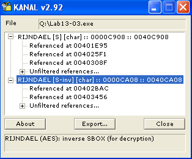
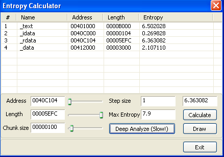
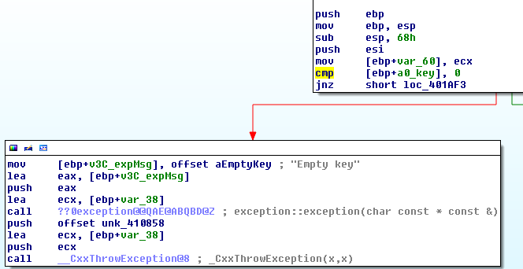
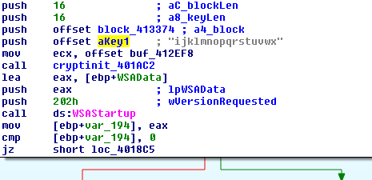
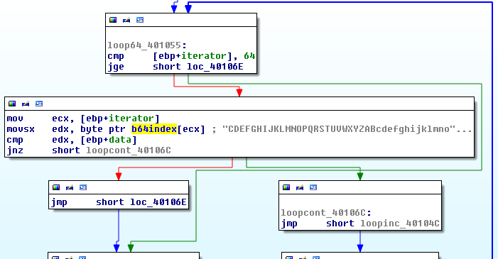
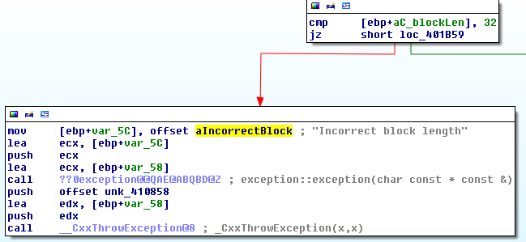
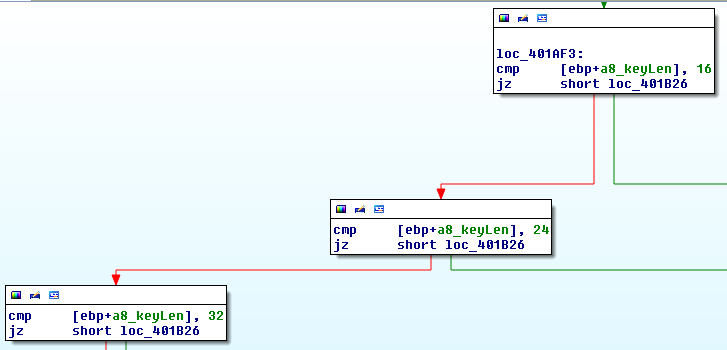
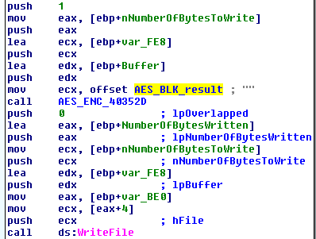
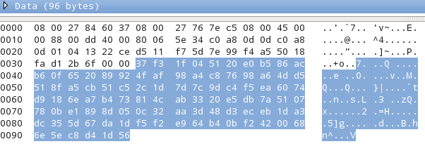

This post is part of the series of [Practical Malware Analysis Exercises.](../index.md)


## 1) Compare the output of strings with the information available via dynamic analysis. Based on this comparison, which elements might be encoded?

Nothing is immediately clear from the strings alone. The `cmd.exe` string might have 
encoded arguments. Basic dynamic analysis suggests that the data being sent over the 
network is encoded.

<!--more-->

The strings output shows what looks to be a nonstandard base64 index string, 
`CDEFGHIJKLMNOPQRSTUVWXYZABcdefghijklmnopqrstuvwxyzab0123456789+/` which suggests base64 
encoding. There are also a lot of longer nonsensical ASCII strings, like 
`,4$8'9-6:.6$1#?*XhHpSeA~NrZlE` and `4$8,9-6'.6$:#?*1hHpXeA~SrZlN` in the results. The 
string `cmd.exe` suggests it runs console commands. Finally the string 
`www.practicalmalwareanalysis.com` suggests network connections to this host.

There was no output when run from the console. RegShot showed no results. Process 
Explorer just showed the process begin and terminate. Searching DLLs and handles in 
Process Explorer turned up nothing. Nothing obvious in Process Monitor.

A Linux VM running inetsim and Wireshark showed DNS requests for 
`www.practicalmalwareanalysis.com` and `8190/tcp` connection attempts. The malware 
immediately terminates if it can't find the host or connect to `8190/tcp`.

If an instance of netcat is listening on the Linux VM, a connection is established and the 
malware doesn't terminate. Sending random data result in what looks like random binary 
data being returned, probably encoded.


## 2) Use static analysis to look for potential encoding by searching for the string xor. What type of encoding do you find?

A search for `xor` found 191 instructions. The following six functions have non-self 
XOR instructions (the interesting kind); 401AC2, 40223A, 4027ED, 402DA8, 403166, and 403990.


## 3) Use static tools like FindCrypt2, KANAL, and the IDA Entropy Plugin to identify any other encoding mechanisms. How do these findings compare with the XOR findings?


A SBOX and inverse SBOX for AES were found under both KANAL and the IDA Entropy Plugin. 
They are only referenced in locations where interesting XOR instructions were found. 
It is assumed that the XOR instructions are part of the AES implementation.

KANAL found a Rijinael (AES) SBOX and inverse SBOX, at 40C908 and 40CA08 respectively. 
The SBOX (for encryption) was referenced at 401E95, 4025F1, and 40308F. The inverse SBOX 
(for decryption) was referenced at 402BAC and 403456. All of these locations are within 
functions that have interesting XOR instructions.





Cross referencing the SBOX shows which functions are used for encryption, and cross 
referencing the inverse SBOX shows which functions are used for decryption.

Under the IDA Entropy Plugin, with a chunk size of 64 and max entropy 5.9, several blocks of 
high entropy content were found in the .rdata section at: 

- 40C908 (sbox)
- 40CA08 (inverse sbox)
- 40CB08
- 40CF08
- 40D308
- 40D708
- dword_40DB08
- 40DF08
- 40E308
- 40E708
- 40EB08
- 40EF08
- 40F308

With a chunk size of 256 (100h) and max entropy of 7.9, only the first two byte strings at 
40C908 (sbox) and 40CA08 (inverse sbox) show up.





## 4) Which two encoding techniques are used in this malware?

Base64 with a non-standard index string, and AES (Rijinael). AES technically isn't 
encoding because it relies on a secret key.


## 5) For each encoding technique, what is the key?

AES: `ijklmnopqrstuvwx` at 412208.
Base64: `CDEFGHIJKLMNOPQRSTUVWXYZABcdefghijklmnopqrstuvwxyzab0123456789+/` at 4120A4.

The strings output shows key validation messages like `Empty key` and
`Incorrect key length`. It isn't guaranteed which encoding algorithm these strings are for, 
so cross referencing them is a good place to start.

Both are referenced in the function 401AC2. The reference to `Empty key` at 401AD2 is 
after the first branch in the function, where the  first argument is compared to 0. This 
suggests that the first argument to 401AC2 is the key.





The area in main at 401895, where that function is called, shows a push of the hardcoded 
16 byte string `ijklmnopqrstuvwx` from 412208 as the first argument. This should be the key.





Finding the Base64 index string at 4120A4 was simple since it wasn't obfuscated. This 
string had one reference, used in a loop at 40105E that iterates through the string for a 
total of 64 rounds.





## 6) For the cryptographic encryption algorithm, is the key sufficient? What else must be known?

Since Base64 doesn't use any variable information for encoding besides the index string, the index string is sufficient. For AES, the ability to decrypt depends on the block cipher mode being used. If it is [Electronic Codebook (ECB)](https://en.wikipedia.org/wiki/Block_cipher_modes_of_operation#Electronic_codebook_.28ECB.29), then the key alone is sufficient. AES operates on 16, 24, or 32 by blocks with a 16, 24, or 32 byte key. Key length is found to be 16 bytes, because we have the key. If [Cipher Block Chaining (CBC)](https://en.wikipedia.org/wiki/Block_cipher_modes_of_operation#Cipher-block_chaining_.28CBC.29) mode is used, then knowing the [initialization vector (IV)](https://en.wikipedia.org/wiki/Initialization_vector) is required to decrypt the first block.

Other strings in function 401AD2 reveal what the remaining AES cryptographic arguments are. 
Argument 3 is the key length, inferred by the string `Invalid key length`. Argument 4 is the 
block length, inferred by the string `Invalid block length`. If argument 1 is the key data, 
argument 3 is the key length, and argument 4 is the block length, then argument 2 should 
be the block data.





The key and block comparisons show that valid lengths for both are 16, 24, or 32 bytes 
(128, 192, or 256 bits), which are the sizes that AES works with.





The block argument is only used in two locations within function 401AD2. In both cases it is being copied to a buffer via [memcpy()](http://msdn.microsoft.com/en-us/library/aa246468%28v=vs.60%29.aspx). Tracing the buffer reveals that it is located in the .data section at 412EF8. That buffer containing block data is also referenced at 401429, when passed to an AES function through the ECX register, immediately before [WriteFile()](http://msdn.microsoft.com/en-us/library/windows/desktop/aa365747%28v=vs.85%29.aspx).





## 7) What does this malware do?

This malware creates a reverse backdoor to `www.practicalmalwareanalysis.com` on `8910/tcp` 
by piping a socket to a command shell's input and output. Incoming commands are Base64 
encoded which require decoding. Outgoing console output is AES encrypted using a 64 bit 
key with CBC mode, and an 64 bit IV of all nulls.

In order:
	
  1. Runs AES cryptographic initialization function with 64 bit static key.
  2. Creates a socket and connects to `www.practicalmalwareanalysis.com` on `8910/tcp`.
  3. Creates a `cmd.exe` process with two pipes attached to the socket for input and output.
  4. Creates two threads, one for piping data from the socket to the cmd.exe process, 
     and one for piping data from cmd.exe back to the socket.
  5. Commands coming in from the socket are run through Base64 decoding and executed.
  6. Console output written to the socket is encrypted with AES before transmission.


## 8) Create code to decrypt some of the content produced during dynamic analysis. What is this content?

The content consists of encoded Windows console commands being sent to the malware, and the 
encrypted console output being returned over the network.

On a Linux VM, netcat was used to listen on port 8910 for the malware's connection attempt, 
and inetsim handled the DNS requests for redirection. Running the sample with a breakpoint 
set on the encryption function before `WriteFile` showed what was going to be encrypted and 
sent. It's the output of a new Windows console, 88 bytes long.


The `WriteFile` call shows 96 encrypted bytes being written. Post-AES, the data byte count 
must be divisible by 16, so padding is added to the 88 bytes. Letting the program continue, 
it sends the encrypted data to the listening netcat, and the data is captured in wireshark.





```text
37f31f045120e0b586acb60f652089924faf98a4c87698a64dd5518fa5cb51c52c1d7d7c9dc4f5ea6074d9186ea7b473814cab3320e5db7a5107780be1898d050c32aa3d48d3eceb1da3dc355d67da1df5f2e964b40bf24200686e5ec8d41d56
```

The data bytes were exported to a text file on a single line, to be fed to a python script 
that uses the [PyCrypto](https://www.dlitz.net/software/pycrypto/) and [binascii](https://docs.python.org/2/library/binascii.html) libraries.

```python
#AES decryption for PMA lab 13.3.

from Crypto.Cipher import AES
import binascii
import string
import sys


def main():
    data = ''
    f = open(sys.argv[1],'r')
    for line in f:
        data += line.strip()

    l = len(data)/2
    p = l%16
    print "[*] " + str(l) + " % 16 = " + str(l%16)
    if p==0:
        print "[*] Decrypting: "+str(l)+" bytes of data.\n"
        decrypt(data)
    else:
        print "[*] Not divisible by 16: "+str(l)+" bytes of data. " + \
          str(l) + " % 16 = " + str(l%16)


def decrypt(data):
    ctxt = binascii.unhexlify(data.replace(' ',''))
    iv=binascii.unhexlify('d63b4ad6f6d9ac9b608ec8b42734b1ca')

    obj = AES.new(b'ijklmnopqrstuvwx', AES.MODE_CBC, iv)
    print obj.decrypt(ctxt)


if __name__ == '__main__':
    main()
```

The Electronic Code Book (ECB) mode only decrypted the first block, so the same parameters 
aren't used for all blocks. Cipher-Block Chaining is probably being used.

```powershell
Microsoft WindowD╙GTq{╢╨⌠▀▀`♂ ╝╝~ü¬Æ°F┼½G²↕ªàê>╡Uo¶←⌡░╒█YL∞5\ùäBí☺┬PR迧7sXHÄ√²+☺8º7↓Θ░╒↔ú▄5]g┌↔
```

The Cipher-Block Chaining (CBC) mode requires an initialization vector (IV) paramater, 
which was set to `0000000000000000`, and decrypted all data except the first block. With 
CBC mode in block ciphers, that means the IV was wrong.

```powershell
}YSB_C_VD►gY^T_G**s XP [Version 5.1.2600]
(C) Copyright 1985-2001 Microsoft Corp.

Q:\>
```

Changing the IV to 16 NULL characters (0x00) decrypted all of the data. Using all NULL 
characters was an educated guess, because ECB mode was able to decrypt the first block 
with just the key, and doesn't use an IV, inferring that the key was directly applied.

```powershell
Microsoft Windows XP [Version 5.1.2600]
(C) Copyright 1985-2001 Microsoft Corp.

Q:\>
```

Next, I wanted to see if I could send encoded commands to the malware and decrypt the response.
The following python script Base64 encodes and decodes data using the custom index string. 
Commands sent to the infected host need a newline character, so this script was tweaked to 
automatically append one when encoding. It also displays the hex to verify the bytes. The 
Windows command `cacls C:\` was encoded as `A2HldJOiSbqkEi==` with the script.

```python
#Base64 encoding for PMA lab 13.3.

import base64
import string
import sys

std_index = "ABCDEFGHIJKLMNOPQRSTUVWXYZabcdefghijklmnopqrstuvwxyz0123456789+/"
mod_index = "CDEFGHIJKLMNOPQRSTUVWXYZABcdefghijklmnopqrstuvwxyzab0123456789+/"

def main():

	if len(sys.argv) < 2:
		print "Not enough arguments."
		sys.exit()

	op = sys.argv[1]
	data = sys.argv[2]

	if op=="d":
		data = b64translate(mod_index, std_index, data)
		data = base64.decodestring(data)
		print data + "  ("+data.encode("hex")+")"

	elif op=="e":
		data = base64.encodestring(data+chr(0xa))
		data = b64translate(std_index, mod_index, data)
		print data + "  ("+data.encode("hex")+")"

	else:
		print "Bad operation selection."

def b64translate(s_index, d_index, data):
	result = ""
	for ch in data:
		if ch in d_index:
			result += d_index[string.find(s_index,str(ch))]
		elif ch == '=':
			result += ch
	return result

main()
```

I set a breakpoint after the Base64 function decodes (401553) to see what the malware received,
and another at the encryption call before `WriteFile` (40142E) to see what the malware responds
with. The command was received by the malware and successfully decoded.


The coresponding response was encrypted and sent.


Unfortunately, CBC mode decrypted all contents except for the first 16 byte block, so the IV 
was different than before. The IV must be sent somehow. Looking at the packets from the malware,
I noticed one that was 16 bytes in length, sent before the encrypted data. I used that as the 
IV, `0c8c160e8ec2fdf8702caa4767688a95`, and it successfully decrypted everything.


```powershell
C:\ BUILTIN\Administrators:(OI)(CI)F
NT AUTHORITY\SYSTEM:(OI)(CI)F
CREATOR OWNER:(OI)(CI)(IO)F
BUILTIN\Users:(OI)(CI)R
BUILTIN\Users:(CI)(special access:)
FILE_APPEND_DATA

BUILTIN\Users:(CI)(IO)(special access:)
FILE_WRITE_DATA

Everyone:R

Q:\>
```

Further work could be done to create a python script that acts as the C&C server, sending 
Base64 commands, receiving AES results, and updating the IV. A modified version of the script 
in chapter 7 of [Gray Hat Python](http://www.nostarch.com/ghpython.htm) could be used for 
this purpose.
