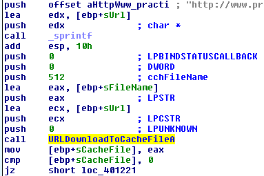
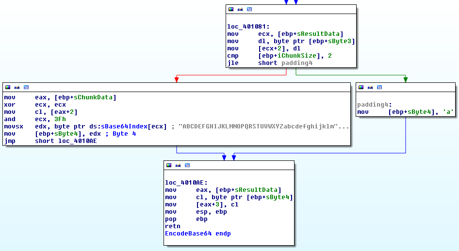

This post is part of the series of [Practical Malware Analysis Exercises.](../index.md)


## 1) Which networking libraries does the malware use, and what are their advantages?

`urlmon` was the only imported networking library, with a single call to [URLDownloadToCacheFile](http://msdn.microsoft.com/en-us/library/ie/ms775122%28v=vs.85%29.aspx) at 401209. The advantage of this high level library is that it is simple to use, and fills in network details, allowing it to blend in with other requests. According to the documentation, it could be used to call from a COM object.




<!--more-->


## 2) What source elements are used to construct the networking beacon, and what conditions would cause the beacon to change?


The last 12 bytes of the GUID for the current hardware profile of the system, which is specific to each user, and the current username are used to construct the beacon. A different user being logged in, or a different hardware profile, would cause the beacon to change.

The first thing the malware does is call [GetCurrentHwProfile](http://msdn.microsoft.com/en-us/library/windows/desktop/ms724311%28v=vs.85%29.aspx) and extract the last 12 bytes of the 36 byte GUID for the current user's hardware profile. Then it calls [GetUserName](http://msdn.microsoft.com/en-us/library/windows/desktop/ms724432%28v=vs.85%29.aspx). Both of these are inserted into a format string, with the username first and the GUID second.


The resulting string `80:6d:61:72:69:6f-bobby` is then Base64 encoded.


## 3) Why might the information embedded in the networking beacon be of interest to the attacker?


From this information, the attacker has a valid username for the system, which can be used for targeting. It also uniquely identifies the host, even if multiple infections have the same username.


## 4) Does the malware use standard Base64 encoding? If not, how is the encoding unusual?


The malware is not using standard Base64. It uses the character `a` instead of `=` for padding.

To see what is happening with the encoding, I looked at the Base64 index string, and traced it to the function at 401000. This function is only called from the function at 4010BB, which is called from main. Both look like encoding functions. The arguments to 4010BB are the string to be encoded, and a buffer for the result.

To verify that 401000 is just a Base64 function, I set a breakpoint after it gets called at 401157, to see what it did to the input. The first three characters `80:` were passed, and `0DA6` was returned. Standard Base64.


Something interesting happened when it encoded the last characters. The source string `80:6d:61:72:69:6f-bobby` is 23 characters long, so it requires padding. The Base64 for `by` is `Ynk=`, but the function encoded it as `Ynka`, so it uses `a` as padding.


Verifying in IDA was easy with a quick look at the function located at 401000.





The encoded string is`ODA6NmQ6NjE6NzI6Njk6NmYtYm9iYnka` (32 bytes) and the full URL is `http://www.practicalmalwareanalysis.com/ODA6NmQ6NjE6NzI6Njk6NmYtYm9iYnka/a.png`


## 5) What is the overall purpose of this malware?


This program is a downloader. The malware uniquely identifies itself to a server with a GET request, and downloads a PE executable file with a `.png` extension to the Internet cache. The executable is then run.


## 6) What elements of the malware's communication may be effectively detected using a network signature?

A DNS request for the domain `www.practicalmalwareanalysis.com` and any communication with its associated IP address could be used in the signature. This wouldn't be sufficient if the server was a hacked one that also serves legitimate traffic.

A more comprehensive signature would look for a HTTP GET request that has the structure of:

- A single directory.
- The directory length is at least 28 characters long.
- The directory length is evenly divisible by 4.
- The directory name only contains standard Base64 characters.
- The file name is a single Base64 character.
- The file name is the last character of the directory.


## 7) What mistakes might analysts make in trying to develop a signature for this malware?

Not accounting for the custom padding character.

Over-specificity (false negative):

- Match only GET requests from a particular host trigger the rule.
- Match only fixed length Base64 strings.
- Match only Base64 directory names that end in `a`

Too loose (false positive):
	
- Any URL that has a single character file name for a `.png` request.
- Matching any Base64 encoded directory name.
- Matching any DNS request for, or communication with, the specific server (if it's legitimate).
- Not restricting the character set or string length.


## 8) What set of signatures would detect this malware (and future variants)?


This is the signature that I settled on in `/etc/snort/rules/local.rules`. The backslashes at the end of lines are for multi-line rules. In practice the rule is all on one line.

```text
alert tcp $HOME_NET any -&amp;gt; $EXTERNAL_NET $HTTP_PORTS \
  (msg:"PMA Lab 14.1 beacon"; flow:to_server; \
  content:"GET"; http_method; \
  pcre:"/\/[a-zA-Z0-9+/]{24}([a-zA-Z0-9+/]{3}([a-zA-Z0-9+/]){1})+\/\2\.[a-zA-Z0-9]{3}/"; \
  sid:1000009)
```


The rule header expands the watched ports from 80 to all defined HTTP ports, in case future variants change this.

```text
alert tcp $HOME_NET any -&gt; $EXTERNAL_NET $HTTP_PORTS \
```


The rule options only look for HTTP GET requests to servers.

```text
 (msg:"PMA Lab 14.1 downloader"; flow:to_server; \
 content:"GET"; http_method; \
``` 


The first part of the regular expression looks for 24 valid Base64 characters (the truncated GUID), then at least one more set of 4 valid Base64 characters, all between two `/` characters. The last Base64 character is put into its own group within parenthesis, so that it can be referenced.

```text
pcre:"\/[a-zA-Z0-9+/]{24}([a-zA-Z0-9+/]{3}([a-zA-Z0-9+/]){1})+\/
```


The second part of the regular expression looks for a file name containing a single character, which must be the same character as the last Base64 character of the directory. This is achieved by referencing the second regex group, `\2`. Since the extension `png` is hardcoded in the URL format string, it would be simple for the malware author to modify those three bytes and bypass a signature looking only for that extension. I expanded the match to include any three alpha-numeric characters as a slight future-proofing measure.

```text
\2\.[a-zA-Z0-9]{3}"; \
```


Finally, the rule is given a signature ID.

```text
sid:1000009)
```

When tested with the malware itself, and various other GET requests from IE, the alert was triggered in the expected situations.


The domain name `www.practicalmalwareanalysis.com` was ommitted because it might be a legitimate server that was compromised, but also because the C&C server can change.

Note: The book's snort signature took into account that the pattern `XX:` will have the last character be `6` when Base64 encoded, resulting in a more targeted and effective signature.
