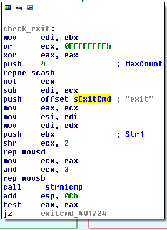

This post is part of the series of [Practical Malware Analysis Exercises.](../index.md)

## 1) What are the advantages or disadvantages of coding malware to use direct IP addresses?

IP
- Pro: No noisy DNS requests with cleartext strings that could give away names or be flagged by an IDS.
- Con: Can be brittle to change and inflexible.

DNS
- Pro: Resilient to change.
- Con: Noisy, easy to detect, queries stored in caches.

<!--more-->

## 2) Which networking libraries does this malware use? What are the advantages or disadvantages of using these libraries?

`WinInet` is the only network specific library imported. The advantage to this library is that is is very simple to use, and fills in header information, making it look like a normal request. A disadvantage is that higher level libraries are less flexible.

As a side note, [ReadFile](http://msdn.microsoft.com/en-us/library/windows/desktop/aa365467%28v=vs.85%29.aspx) and [WriteFile](http://msdn.microsoft.com/en-us/library/windows/desktop/aa365747%28v=vs.85%29.aspx) are imported from Kernel32. These can be used for socket I/O.


## 3) What is the source of the URL that the malware uses for beaconing? What advantages does this source offer?

The URL is located within a resource at`String Table\1\1033`and is in Unicode instead of ASCII. It has the advantages of not being picked up by some string checks, and being located in a resource section that is decoupled from the EXE, so it is dynamically configurable.

The resource had the following contents:

```text
STRINGTABLE
LANGUAGE LANG_ENGLISH, SUBLANG_ENGLISH_US
{
  1,     "http://127.0.0.1/tenfour.html"
}
```


Looking at the `.rsrc` section in PEView showed how the string was laid out in the file. It has a null byte after each character, making it a 16-bit unicode string (8-bit variable width for ASCII compatibility).


The URL was not immediately picked up by the strings program on Windows. By default, strings doesn't check all sections or encodings. Using the `-a` flag to search all sections, and the `-el` flag to search for a 16-bit little endian string.

```powershell
strings -a -el Lab14-02.exe
http://127.0.0.1/tenfour.html
```


## 4) Which aspect of the HTTP protocol does the malware leverage to acheive its objectives?

The malware is sending and receiving data through the User Agent field for HTTP requests.

Setting a breakpoint on [InternetOpen](http://msdn.microsoft.com/en-us/library/windows/desktop/aa385096%28v=vs.85%29.aspx) at 4017C4, and letting the program run, shows what looks like Base64 encoded data being passed as the first argument (the User Agent).


## 5) What kind of information is communicated in the malware's initial beacon?

The initial connection sends the encoded intial text of a Windows console.

After determining that InternetOpen was being used to populate the user agent, I wanted to identify what the data was. It appeared to be encoded. Graphing the functions in the program showed one at 401000, with no further calls. This function accepts two buffers as arguments and was called directly before the subroutine with InternetOpen, so it seemed like a good encoding candidate.

A breakpoint after the call to 401000 revealed what was being fed to the program: the initial text of a Windows console.


The Base64 string is then prepended with `(!<`, probably as a marker of sent versus received data.


## 6) What are some disadvantages in the design of this malware's communication channels?

A large User Agent string is very likely to be detected. The GET requests for outgoing data will always have a hard coded `(!<` prefix that can be targeted by signatures. It also appears that while there is an encoding function for outgoing content, there is no decoding function for incoming content, so incoming commands are sent in the clear.

## 7) Is the malware's encoding scheme standard?

No, it uses Base64 with a custom index string located at 403010: `WXYZlabcd3fghijko12e456789ABCDEFGHIJKL+/MNOPQRSTUVmn0pqrstuvwxyz`

Before:

```powershell
Microsoft Windows XP [Version 5.1.2600]
(C) Copyright 1985-2001 Microsoft Corp.

Q:\>
```

After:
 
```text
e6LJC+xnBq90daDNB+1TDrhG6aWG6p9LC/iNBqsGi2sVgJdqhZXDZoMMomKGoqxUE73N9qH0dZltjZ4RhJWUh2XiA6imBriT9/oGoqxmCYsiYG0f4eNCkG==
```

This was verified with a python script that converts to and from Base64 with non-standard index strings.


## 8) How is communication terminated?

The malware receives the command `exit` from the server.

This code for the check is in the input thread at 40167A.





## 9) What is the purpose of this malware, and what role might it play in the attacker's arsenal?

This malware is a reverse command shell, which can be used by the attacker to execute arbitrary commands on infected machines. It also tries to delete itself upon failure or termination of the connection, so it is probably only meant for one-time use.
