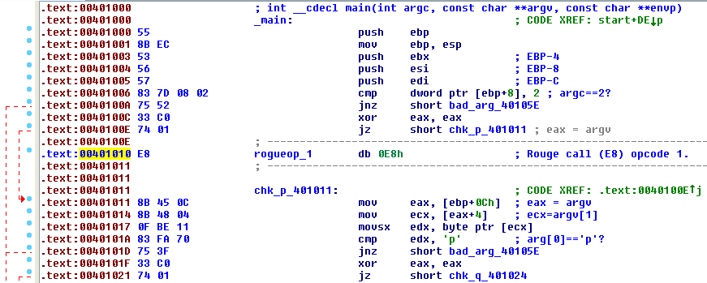
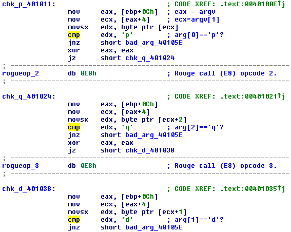

This post is part of the series of [Practical Malware Analysis Exercises.](../index.md)

## 1) What anti-disassembly technique is used in this binary?

Rogue opcodes are inserted after conditional jump instructions. Since the conditional jumps always evaluate to true, the bogus opcode is never called, but IDA disassembles the "branch" as if it were.

<!--more-->

Changing the rogue opcode to data (`d` hotkey) and forcing the rest of the bytes to code (`c` hotkey) revealed the true instructions.

## 2) What rogue opcode is the disassembly tricked into disassembling?

Rogue opcodes for the `CALL` instruction, `E8`, are inserted after conditional jump instructions. The next byte is `8B`, the opcode for a `MOV` instruction.

## 3) How many times is this technique used?

It is used five times at the following locations:

  1. rogueop_1 00401010
  2. rogueop_2 00401023
  3. rogueop_3 00401037
  4. rogueop_4 0040104B
  5. rogueop_5 00401062

## 4) What command-line argument will cause the program to print "Good Job!"?

The command line argument being looked for is `pdq` which prints the success string.

The program checks for the characters out of sequence: byte 0, 2, 1.

