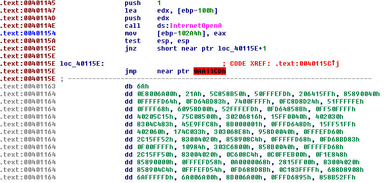
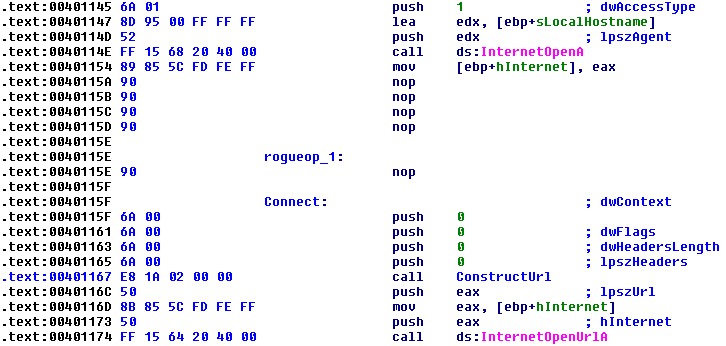
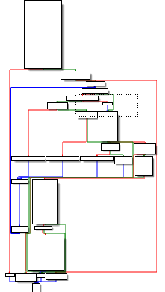
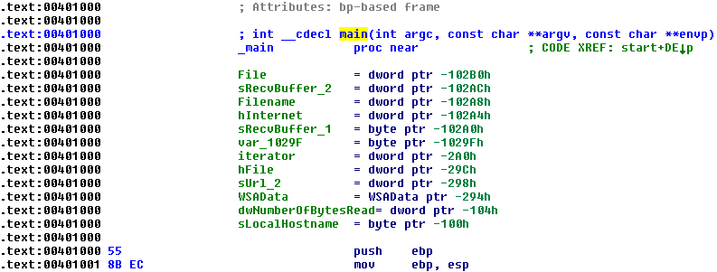
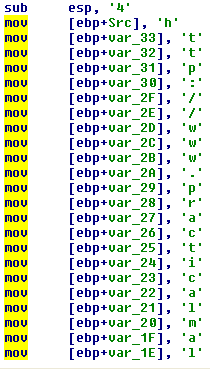
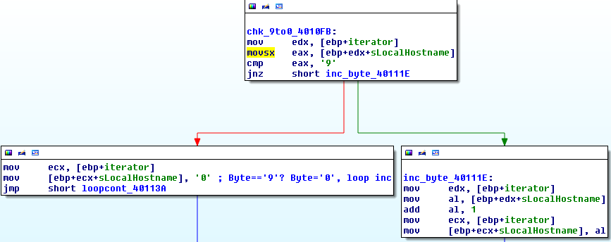

This post is part of the series of [Practical Malware Analysis Exercises.](../index.md)

## 1) What URL is initially requested by the program?

The initial URL is `http://www.practicalmalwareanalysis.com/bamboo.html`

First things first. Went through the program looking for the busted XREFs and fixing them by NOP'ing out the anti-disassembly measures. Three rogue opcodes and two dual opcodes.

<!--more-->

Then the `main()` function was updated with the "Create Function" function. Now that `main()` was a series of clean paths, it had properly named local variables and could be viewed in Graph Mode.

Next, analyzing the call to [InternetOpenURL](http://msdn.microsoft.com/en-us/library/windows/desktop/aa385098%28v=vs.85%29.aspx) at 401174 shows that the URL is obtained from a function call to 401386.

The function at 401386 builds the URL on the stack. It has 52 stack variables declared, one for each character in the URL and the null termination. Converting the integers to their characer representation revealed the initial URL.

## 2) How is the User-Agent generated?

The User-Agent is  a modified version of the local hostname. The local hostname is obtained from a call to [gethostname](http://msdn.microsoft.com/en-us/library/windows/desktop/ms738527%28v=vs.85%29.aspx) at 401053. Then a custom string manipulation loop is run that converts the characters `Z` to `A`, `z` to `a`, and `9` to `0`. Every other character is incremented by 1.

## 3) What does the program look for in the page it initially requests?

The program looks for the string `Bamboo::` in the first requested page.

## 4) What does the program do with the information it extracts from the page?

This program is a downloader. The information in the first page, after the string `Bamboo::`, is a URL to a second page. The second page is requested, and its contents are dumped into the file `AccountSummary.xls.exe` in the local directory. Finally, the downloaded file is executed with a call to [ShellExecute](http://msdn.microsoft.com/en-us/library/windows/desktop/bb762153%28v=vs.85%29.aspx) at 401300.
