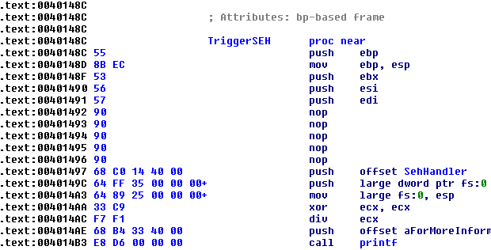
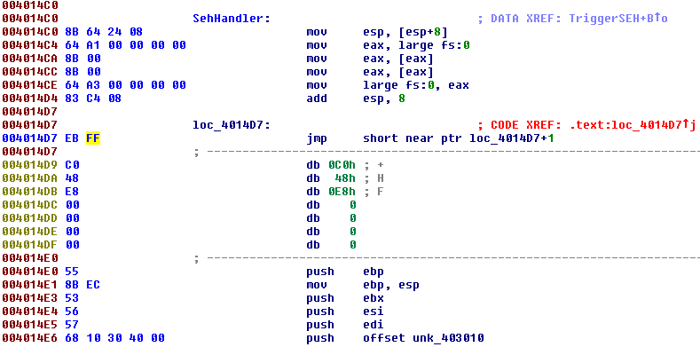
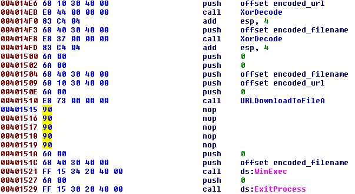
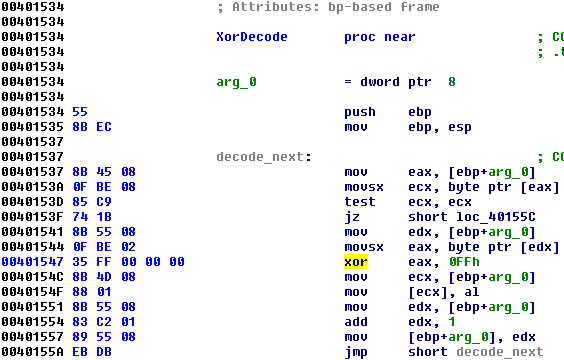

This post is part of the series of [Practical Malware Analysis Exercises.](../index.md)

## 1) How is the malicious code initially called?

The program calls the malicious code by overwriting the return address of `main()`, and then causing an exception to execute a custom SEH handler.

At the beginning of `main()` the program constructs the new return address, 40148C, and then sets the return pointer (EBP+4) to it.

There are several anti-disassembly measures obfuscating the malicious code.

<!--more-->

The return function is not recognized as one. A rogue JMP opcode (`E9`) was inserted at 401496, which is jumped over.

All of the anti-disassembly bytes were converted to `nop`s, and the code was specified as a function. This part creates a new SEH record with the handler at 4014C0. Then it divides by zero to have it executed.

## 2) What does the malicious code do?

The code downloads a file from a URL and executes it.

The SEH handler at 4014C0 is the malicious code. Addresses 4014D7 through 4014DA and 401515 through 401519 were anti-disassembly bytes, so they were turned to NOPs.

From the function calls, the intention of this code was quickly discovered to download and execute a file.

## 3) What URL does the malware use?

The URL the file is downloaded from is `http://www.practicalmalwareanalysis.com/tt.html`.

The URL string was located at 403010, encoded as`ùïïÅ+--êêê-ÅìP£ïû£PôÆPôêPìÜPæPôåîûî-£ÉÆ-ïï-ùïÆô`. It was passed to an XOR decoding function at 401534, which XORs each byte with 0xFF.

The executable was opened in [Hex Edit](http://www.hexedit.com/), and the string was decoded.

## 4) What filename does the malware use?

The file is downloaded to `spoolsrv.exe`.

The filename was located at 403040, also XOR encoded against byte 0xFF.

