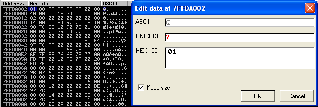
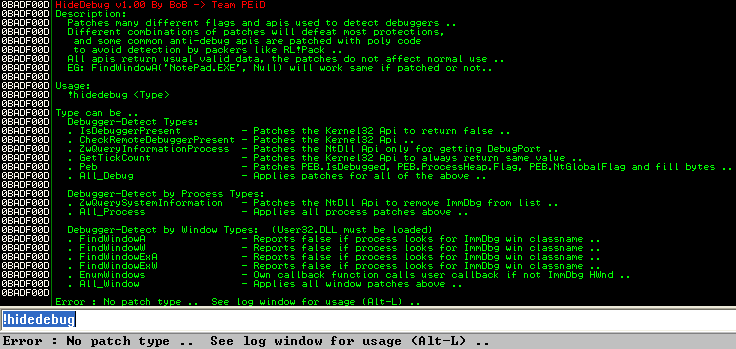

This post is part of the series of [Practical Malware Analysis Exercises.](../index.md)

## 1) Analyze this sample using a debugger. Which anti-debugging techniques does this malware use?

The program checks for flags linked to the [Process Environment Block (PEB)](http://msdn.microsoft.com/en-us/library/windows/desktop/aa813706%28v=vs.85%29.aspx) that indicate debugging: BeingDebugged, ForceFlags (XP), and NtGlobalFlags.

The anti-debugging code starts in function 403530, at 403540. Local variables are initialized, and then the flags BeingDebugged (PEB+02h), ForceFlag (ProcessHeap+10h, XP offset), and NtGlobalFlag (PEB+68h) are checked.


<!--more-->


## 2) What happens when each anti-debugging technique succeeds?

When an anti-debugging technique succeeds, the program tries to delete itself from disk and terminate.


## 3) How can you get around these anti-debugging techniques?

To get around the anti-debugging flag checks, change the flags in memory during runtime.

If PEB is located at 7FFDA000, then set the following memory addresses:

```text
7FFDA002: BeingDebugged =00
7FFDA068: NtGlobalFlags =00
00140010: ForceFlags    =00 00 00 00
```

Patching is also an option.


## 4) How do you manually change the structures checked during runtime?

Find the memory address of PEB, view the address in the dump window, and fill the offset bytes with zeros.

Once the anti-debugging measures were found, a breakpoint was set on the first one to determine the address. After the instruction`MOV EAX,DWORD PTR FS:[30]`, the EAX  register was set to 7FFDA000, the address of PEB. The offset PEB+02h (7FFDA002) contained the BeingDebugged flag byte. Displaying this addresses in the dump showed what was expected: BeingDebugged flag set. This was zero'd out with a binary edit.





The same was done for the `ForceFlag` at PEB+68h (7FFDA068), and `NtGlobalFlag` at ProcessHeap+10h (00140010).

Passed the arguments`-in abcd`to install the program, as discovered in 9.1, and the program installed successfully.


## 5) Which OllyDbg plug-in will protect you from the anti-debugging techniques used by this malware?

There are severeal [OllyDbg plugins](https://tuts4you.com/download.php?list.94) to hide a debugger ([Hyde](https://tuts4you.com/download.php?view.3193), [HideOD](https://tuts4you.com/download.php?view.3194)). For [Immunity Debugger](http://www.immunitysec.com/products-immdbg.shtml), the included "hidedebug" plugin will automatically patch the flag bytes.




