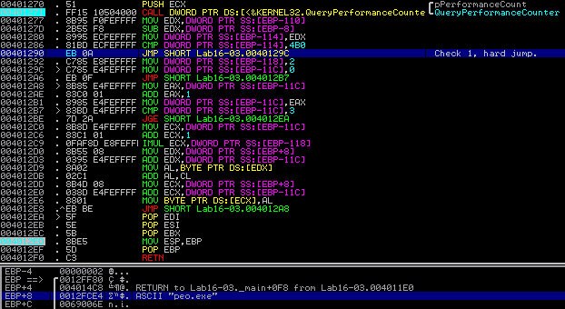
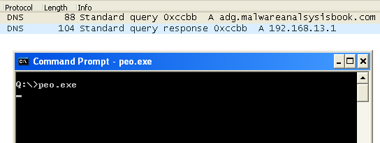

This post is part of the series of [Practical Malware Analysis Exercises.](../index.md)


## 1) Which strings do you see when using static analysis on the binary?

```text
cmd.exe
>> NUL
/c del
```

## 2) What happens when you run this binary?

From the command line, nothing.


## 3) How must you rename the sample in order for it to run properly?


Single stepping from main, the string `ocl.exe` was passed to 4011E0 as argument 1 (EBP+8). WIthin function 4011E0 was a pair of calls to [QueryPerformanceCounter](http://msdn.microsoft.com/en-us/library/windows/desktop/ms644904%28v=vs.85%29.aspx), an anti-debugging measure.

<!--more-->


To defeat this measure, I wanted to see the code path that would be taken for failure, and invert it. I configured Immunity to pass all exceptions to the target, set a breakpoint after the second QueryPerformanceCounter call, and let the program run. Single stepping to the conditional jump (`jle`) at 401290 revealed that it wouldn't be taken. Patching this to a hard jump had the desired effect, and the program let me continue.





At the function's end, argument 1 (EBP+8) was transformed to the string `peo.exe`.


## 4) Which anti-debugging techniques does this malware employ?


Each of the anti-debugging techniques are used to measure time delays caused by the debugger. They use pairs of instructions to get a timestamp, do something, take a second timestamp, and then compare the timestamp difference. If the difference is beyond a specified threshold, a debugger could be slowing down execution.

- First, it uses [QueryPerformanceCounter](http://msdn.microsoft.com/en-us/library/windows/desktop/ms644904%28v=vs.85%29.aspx) calls at 40121D and 401271 during the filename check.
- Second, it uses [GetTickCount](http://msdn.microsoft.com/en-us/library/windows/desktop/ms724408%28v=vs.85%29.aspx) calls at 401584 and 401595 during network initialization.
- Third, it uses [rdtsc](http://msdn.microsoft.com/en-us/library/twchhe95.aspx) instructions at 401323 and 40136D, during generation of the domain name.


## 5) For each technique, what does the malware do if it determines it is running in a debugger?

Each does something different to hidner analysis.

- If the QueryPerformanceCounter check detects the debugger, the malware will manipulate the filename string to return `qgr.exe` as the name to check against. If the program is renamed to `qgr.exe` it will not execute.
- If the `GetTickCount` check detects the debugger, the malware will try to write data to memory address 00000000, causing an access violation and crashing the program at 4015B4.
- If the `rdtsc` check detects the debugger, the malware will try to delete itself on the command line with a call to function 4010E0.


## 6) Why are the anti-debugging techniques successful in this malware?

The anti-debugging techniques are successful because debuggers add overhead to program execution, causing time delays. These delays are large enough to be detected via the techniques used in this sample. Even when passing all exceptions in Immunity, the program still detects a debugger.


## 7) What domain name does this malware use?

`adg.malwareanalysisbook.com` is the domain name that this sample connects to.

After discovering the correct filename (`peo.exe`), and renaming the executable, basic dynamic analysis with Wireshark was able to identify the domain name. No patches necessary.





For deeper confirmation, the following conditional jumps were patched to hard jumps to bypass the checks:

```text
Address    Old                     New                      Comment
00401290   JLE SHORT peo.0040129C  JMP SHORT peo.0040129C   Check 1, QueryPerformanceCounter.
004015B0   JBE SHORT peo.004015B7  JMP SHORT peo.004015B7   Check 2, GetTickCount.
0040137E   JBE SHORT peo.00401385  JMP SHORT peo.00401385   Check 3, rdtsc.
```


A breakpoint was set on the call to gethostbyname at 4015DB, which showed `adg.malwareanalysisbook.com` being passed to it.


