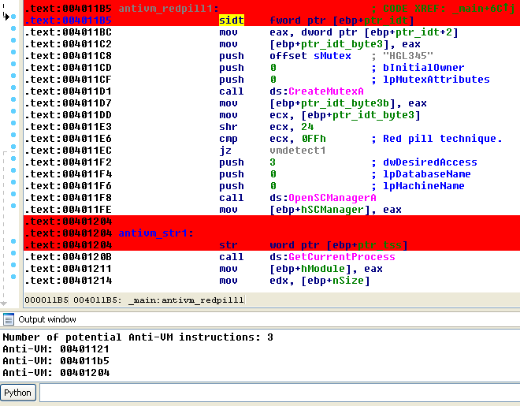

This post is part of the series of [Practical Malware Analysis Exercises.](../index.md)

## 1) What anti-VM techniques does this malware use?


The anti-VM capable x86 instructions `sidt`, `sldt`, and `str` were used once each.

A quick case-sensitive regular expression text search,`(sidt |sgdt |sldt |smsw |str |in |cpuid)`, showed 3 anti-VM capable instructions in this program.

- `sidt` at 4011B5
- `sldt` at 401121
- `str` at 401204


<!--more-->

The [sidt](http://pdos.csail.mit.edu/6.828/2005/readings/i386/SGDT.htm) instruction is used in the [red pill VM detection technique](http://web.archive.org/web/20070911024318/http://invisiblethings.org/papers/redpill.html) in main at 4011B5. The sidt instruction is called to load the [IDT](https://en.wikipedia.org/wiki/Interrupt_descriptor_table) register, and move the IDT address into a local variable. Then the third byte is shifted and compared to 0xFF.

The [sldt](http://pdos.csail.mit.edu/6.828/2005/readings/i386/SLDT.htm) instruction is used in the [no pill VM detection technique](http://www.offensivecomputing.net/files/active/0/vm.pdf), which has its own function at 401100. It returns the value of the [LDT](https://en.wikipedia.org/wiki/Local_Descriptor_Table) register, which is compared against zero. Since Windows doesn't use the LDT, the address should be zero if there is no VM.


## 2) If you have the commercial version of IDA Pro, run the IDA Python script from Listing 17-4 in Chapter 17 (provided here as findAntiVM.py). What does it find?


The `findAntiVM.py` script produced the following output in the IDA console:
 
```text
Number of potential Anti-VM instructions: 3
Anti-VM: 00401121
Anti-VM: 004011B5
Anti-VM: 00401204
```

Each of the addresses in the output were clickable, and each of the instructions were highlighted in red.





## 3) What happens when each anti-VM technique succeeds?

The `sidt` (red pill) and str checks both trigger a call to 401000, which will delete the binary from disk via the command line, and then terminate the process. The sldt (no pill) check returns without executing the payload, similar to an error condition, but after the service is created.


## 4) Which of these anti-VM techniques work against your virtual machine?

None of the techniques work.


## 5) Why does each anti-VM technique work or fail?

Here is an interesting post on [obsolete VM detection techniques](http://www.secret-zone.net/threads/4472-How-not-to-detect-virtualization).


The `sidt` instruction returns the 6-byte `IDTR` (IDT Register), with the 4 most significant bytes being an IDT base address, and the 2 least significant bytes being a limit field. When executed, `sidt` stored the following six bytes at EBP-428: 8003F400 07FF. The red pill technique fails because it compares the 2 most significant bytes of the IDT address to 0xFF, but my VM (VirtualBox) returns the IDT address 8003F400, and 0x80 != 0xFF.


 
The str instruction stores the 2-byte segment selector at EBP-418. My VM returned 0028. The anti-VM check fails in its comparison of the least significant byte to 0xFF, since 0x28 != 0xFF.


The sldt instruction stores the 2-byte segment selector at EBP-8. My VM returned 0000, which is the expected value of a non-virtualized Windows machine (since it doesn't use the LDT). The no pill technique fails because it is looking for something other than 0000 in LDTR.


## 6) How could you disable these anti-VM techniques and get the malware to run?

Each of the techniques use a conditional jump

Each of the three checks can have their conditional jumps patched to always execute.

- Check #1 at 4011EC, jump on detect, NOP the jump.
- Check #2 at 401237, don't jump on detect, set a hard jump.
- Check #3 at 4012DB, jump on detect, NOP the jump.
