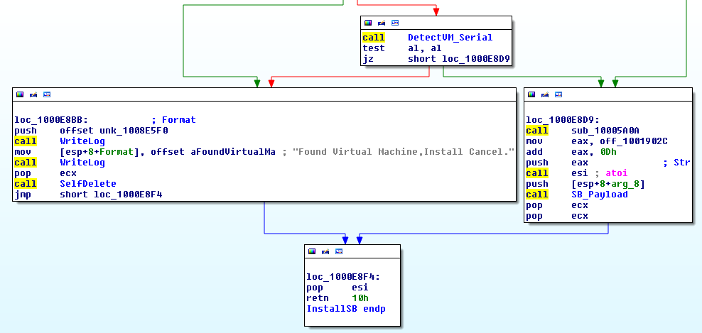

This post is part of the series of [Practical Malware Analysis Exercises.](../index.md)


## 1) What are the exports for this DLL?

```text
Name          Address  Ordinal
----          -------  -------
InstallRT     1000D847 1      
InstallSA     1000DEC1 2      
InstallSB     1000E892 3      
PSLIST        10007025 4      
ServiceMain   1000CF30 5      
StartEXS      10007ECB 6      
UninstallRT   1000F405 7      
UninstallSA   1000EA05 8      
UninstallSB   1000F138 9
```

<!--more-->

## 2) What happens after the attempted installation using rundll32.exe?

The VM detection failed, and normal execution proceeded.
	
- The InstallRT command copied the DLL to `C:\WINDOWS\system32\Lab17-02.dll`, and also created a installation log in the working directory.
- The InstallSA command modified two registry keys for the service `Irmon`, and created/wrote to `C:\WINDOWS\win.ini`.
- The `InstallSB` command loaded sfc_os.dll, wintrust.dll, crypt32.dll, and msasn1.dll.
- All three commands wrote to the log file and started threads.


## 3) Which files are created and what do they contain?


The DLL was copied to `C:\WINDOWS\system32\Lab17-02.dll`.

All three commands wrote to the (very explicit) log file `xinstall.log` in the working directory.

```text
[11/08/14 22:47:09]
Copy 'C:\WINDOWS\system32\Lab17-02.dll' To 'C:\WINDOWS\system32\Lab17-02.dll' Failed
The PID Of Process 'iexplore.exe' is '0'
Process 'iexplore.exe' Not Found ,Inject Failed


[11/08/14 23:16:29]
CreateService(Irmon) With Description '' SUCCESS. Config it
Config service Irmon ok.
StartService 'Irmon' Successfully


[11/08/14 23:28:02]
Query service starttype->3
Change Service 'NtmsSvc' To Be Auto-Start
Service 'NtmsSvc' Status already is Stopped.
Not Found Module 'ntmssvc.dll' In Any 'svchost.exe' Process
Copy 'C:\WINDOWS\system32\ntmssvc.dll' To 'C:\WINDOWS\system32\ntmssvc.dll.obak' Successfully
Copy 'C:\WINDOWS\system32\Lab17-02.dll' To 'C:\WINDOWS\system32\ntmssvc.dll' Successfully
Copy 'C:\WINDOWS\system32\Lab17-02.dll' To 'C:\WINDOWS\system32\dllcache\ntmssvc.dll' Successfully
Old Module Not Runing,New ModuleName As Old,Will Take Effect Soon.
StartService 'NtmsSvc' Successfully
```

## 4) What method of anti-VM is in use?

The [`in`](http://www.fermimn.gov.it/linux/quarta/x86/in.htm) instruction is used at 100061DB to query the serial port 0x564D (`VM`) and store the result in EAX. If the result is the VMWare magic number, 0x564D5868 (`VMXh`), then it assumes the environment is a virtual machine.


One way to quickly find this was the python script included with the book, that checks for anti-VM x86 instructions. Another way was cross-referencing the`Found Virtual Machine,Install Cancel.`string.


## 5) How could you force the malware to install during runtime?

Patch the executable in the debugger or use a different virtualization platform.


## 6) How could you permanently disable the anti-VM technique?

The easiest way to permanently disable the anti-VM technique is to patch the executable with a hex editor.

## 7) How does each installation export function work?

Each export function had the same basic layout. They first call a function to detect the presence of VMWare by analyzing a serial port. If VMWare is detected, the program tries to delete itself. Otherwise, the export's true function is executed. All the while, the program writes to the log file `xinstall.log` in the working directory.



