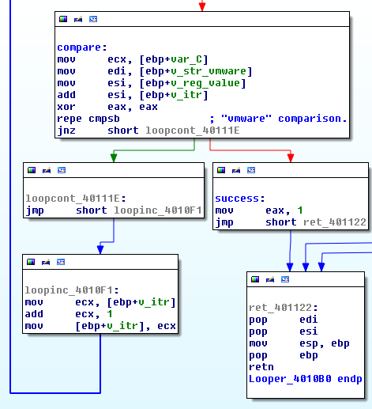
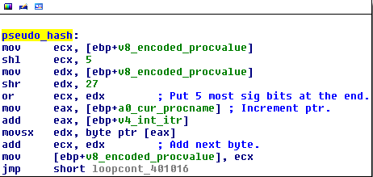

This post is part of the series of [Practical Malware Analysis Exercises.](../index.md)


## 1) What happens when you run this malware in a virtual machine?

Nothing happens. The program just terminates.


## 2) How could you get this malware to run and drop its keylogger?

There was a check having to do with network adapters that kept failing. The first check's conditional jump at `40172A` was patched over with a hard jump directly to `40184A`. This skipped the network adapter check, and let the malware execute as normal.

<!--more-->

## 3) Which anti-VM techniques does this malware use?

There are four checks for VM detection: serial port, registry, MAC addres, and process name.


### Serial Port

First, the malware checks for the VMWare magic number (`VMXh`) on a serial port, using the [in](http://www.fermimn.gov.it/linux/quarta/x86/in.htm) x86 instruction.


### Registry

Second, the function at `4011C0` checks the registry recursively from the key `SYSTEM\CurrentControlSet\Control\DeviceClasses` for the string `vmware`.




### Network Adapter

Third, the check at `4017F4` looks at any ethernet or wireless network adapters, searching for a MAC address with the prefix of a company that makes virtualization software. This one took a little work to figure out exactly what was going on. The situation:

- ECX is set to 3 for each iteration, so the [`repe cmpsb`](http://www.fermimn.gov.it/linux/quarta/x86/rep.htm) instruction will compare three bytes for equality.
- [ESI] is set to the MAC address of the adapter, and `[edi]` is set to a MAC address prefix ([OUI](https://en.wikipedia.org/wiki/Organizationally_unique_identifier)).
- The loop is set for 9 iterations, with 3 bytes compared each time, giving 27 bytes total.

The 27 bytes from `[EDI]` in the debugger memory dump, containing 9 OUIs:

```text
0012FAFC  00 50 56 00 0C 29 00 05
0012FB04  69 00 1C 14 00 03 FF 00
0012FB0C  1C 42 00 16 3E 00 0F 4B
0012FB14  08 00 27
```

Broken into sets of three, and researched on [macvendorlookup.com](http://www.macvendorlookup.com/), all MACs checked are from companies that provide virtualization products:


```text
Iteration 0: 00-50-56 = VMware, Inc.
Iteration 1: 00-0C-29 = VMware, Inc.
Iteration 2: 00-05-69 = VMware, Inc.
Iteration 3: 00-1C-14 = VMware, Inc.
Iteration 4: 00-03-FF = Microsoft Corporation
Iteration 5: 00-1C-42 = Parallels, Inc.
Iteration 6: 00-16-3E = Xensource, Inc.
Iteration 7: 00-0F-4B = Oracle Corporation
Iteration 8: 08-00-27 = Cadmus Computer Systems
```

###  Process List

Fourth, the function at `401130` iterated through all processes, and took a custom pseudo-hash of the first 6 characters in lower case. The encoded result was compared with the constant `F30D12A5h`, presumably another psuedo-hash.



Decoding was difficult without knowing the original string's length, or the last byte. The encoding algorithm was recreated in Python.

```python
import sys


def encode(str):
    result = 0
    for i in range(0,6):
        if not (len(str)+1<i):
            result = (result << 5) | (result >> 27)
            result += ord(str[i])

    return result


print("%s  =  %08X") % (sys.argv[1],encode(sys.argv[1]))
```

Since `vmware` is 6 characters, and was searched for in the registry, that string was tested in the script. The results matched the static value, `F30D12A5h`.

```powershell
Q:\>reverse_encoding.py vmware
vmware  =  F30D12A5
```

## 4) What system changes could you make to permanently avoid the anti-VM techniques used by this malware?

The only check that caught my environment was the network adapter (VirtualBox from Oracle). Changing the MAC address of the virtual adapter made the malware execute.
